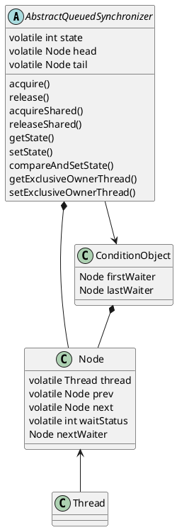

# AbstractQueuedSynchronizer

通过一个原子整数和FIFO队列，以及围绕它们的原子操作，实现了同步器该有的基本功能。原子整数`state`是个抽象的同步资源的概念，基本流程都是围绕着资源的`acquire()`与`release()`进行的，子类需要按需实现以下方法：
* `tryAcquire()`
* `tryRelease()`
* `tryAcquireShared()`
* `tryReleaseShared()`
* `isHeldExclusively()`

关于FIFO队列：
* 节点`Node`有以下几种`waitStatus`：
    * 0：初始状态；某个节点的后继将要被唤醒时，其状态也会从`SIGNAL`改回0（防止多余的唤醒）
    * `CANCELLED`：表示对应的线程已放弃获取资源（发生异常、获取超时时设置）
    * `SIGNAL`：表示该节点移出队列时，需要唤醒后继节点关联的线程；新节点排队并在挂起线程前，会把前驱节点的状态改成`SIGNAL`
    * `CONDITION`：表示关联的线程在等待一个`ConditionObject`
    * `PROPAGATE`：表示下一个`acquireShared`操作需要无条件地传播，即唤醒后继节点；在并发释放共享同步资源时设置，只有头节点可能有该状态
* 头节点`head`和尾节点`tail`默认为`null`
* 首次插入节点时，用一个假节点作为头节点，被插入的节点链在假节点之后
* 头节点的状态必然不是`CANCEL`
* 头节点不属于队列的一部分，被设为`head`的节点等同于移出队列，`thread`与`prev`引用会重置为`null`，其他属性保留（失去头节点身份时才重置`next`）
* 队头实际上是头节点的直接后继节点
* 某个节点取消获取同步资源时，会设置`waitStatus`为`CANCEL`，并更新其前驱非`CANCEL`节点的后继节点引用，但不会马上更新其后继节点的前驱节点引用
    * 因为有并发取消的可能，从某个节点开始寻找其后继的首个有效节点时，如果发现该节点的直接后继节点已经是`CANCEL`状态，需要从`tail`开始往前找
    * 在适当的时机，再遍历前驱节点，找到首个非`CANCEL`状态的节点，并修正当前节点的前驱节点引用

## 互斥资源的操作
`acquire()`的流程如下：
* 先`tryAcquire`，如果失败再考虑排队
* 建立一个节点，标记为独占模式，CAS操作插入队列末尾
* 开始循环：
    * 检查自己是否已排到队头（即直接前驱节点是`head`）
    * 如果自己已排到队头，再次`tryAcquire`；如果成功，将自己设为`head`（即移出队列），跳出循环
    * 如果没有排到队头，或是`tryAcquire`失败，检查前驱节点并挂起当前线程
        * 如果直接前驱节点是`SIGNAL`状态，直接挂起当前线程
        * 如果直接前驱节点是`CANCEL`状态，向前找到首个非`CANCEL`状态的节点，并修正当前节点的前驱节点引用；可能因此排到队头，不挂起当前线程
        * 否则将前驱节点的状态CAS更新为`SIGNAL`；可能前驱节点被并发取消，需要再次检查，不挂起当前线程

如果是可中断的版本，从挂起状态恢复时需检查线程的中断标记，并按需抛出中断异常，调用`cancelAcquire`。如果是带超时参数的版本，在循环开始前记录时间戳，在循环过程中比较时间差，超时时调用`cancelAcquire`。

`cancelAcquire()`的流程如下：`
* 检查并修正当前节点的前驱节点引用
* 将当前节点的`waitStatus`改成`CANCEL`
* 更新前驱节点的后继节点为当前节点的后继节点：
    * 如果当前节点是`tail`，直接CAS把前驱节点设为尾节点
    * 如果前驱节点是头节点，当前节点又被取消了，等同于后继节点排到了队头，因此直接唤醒后继节点
    * 如果再次检查前驱节点发现被取消，或是尝试CAS将状态改成`SIGNAL`失败（可能是并发取消），后继节点也可能排到了队头，因此也唤醒后继节点
    * 其他情况下更新前驱节点的后继节点引用

唤醒后继节点时，会尝试CAS将当前节点的`waitStatus`置0；后继节点唤醒后，按照`acquire`的流程会检查并刷新其前驱节点。

`release()`的流程：调用`tryRelease`，如果返回`true`，即所有同步资源都被释放了，唤醒队列中的首个非取消状态的节点（以头节点为基准，调用唤醒后继节点的流程）。

## 共享资源的操作
`acquireShared()`的流程如下：
* 先`tryAcquireShared`，如果失败再考虑排队
* 建立一个节点，标记为共享模式，CAS操作插入队列末尾
* 开始循环：
    * 检查自己是否已排到队头（即直接前驱节点是`head`）
    * 如果自己已排到队头，再次`tryAcquireShared`
        * 如果返回成功，将自己设为`head`（即移出队列）
        * 如果以下任意条件满足，且当前节点的后继节点也是共享模式（暂时没有后继节点时也尝试释放），执行释放共享资源的流程`doReleaseShared`：
            * `tryAcquireShared`返回的结果表示后续获取共享资源的操作可能成功
            * 原头节点的`waitStatus`小于0（一般是并发释放时被设置成`PROPAGATE`）
            * 当前头节点的`waitStatus`小于0
        * 跳出循环
    * 如果没有排到队头，或是`tryAcquire`失败，执行检查前驱节点并挂起当前线程的流程
 
 可中断版、超时参数版本与获取互斥资源的流程类似。

`releaseShared()`的流程：调用`tryReleaseShared`，如果返回`true`，即释放后允许队列中的节点获取同步资源，执行释放共享资源的流程`doReleaseShared`。

`doReleaseShared()`的流程如下：
* 开始循环：
    * 取头节点，如果头节点也是尾节点，无需处理跳出循环
    * 如果头节点的状态是`SIGNAL`，尝试CAS操作改成0，如果成功则唤醒后继节点，不成功则重新开始循环
    * 如果头节点的状态是0（另一个并发的释放操作把它改成了0），尝试CAS操作改成`PROPAGATE`，如果失败则重新开始循环；在并发地释放、获取共享同步资源时必须靠`PROPAGATE`状态保证后继节点能正常唤醒
    * 再次检查头节点，如果头节点不变则可跳出循环

## `PROPAGATE`状态的必要性分析
假设一个总数为2的信号量，设置一下场景：
* 初始状态：线程A、B拿完了两个共享资源，线程C、D排队等待获取
* 操作：线程A、B并发释放共享资源
* 预期结果：线程C、D都能唤醒并获取到共享资源

释放共享资源中的关键操作：
* 如果头节点是`SIGNAL`状态，CAS改成0（防止多余的唤醒操作），后再唤醒后继节点
* 如果头节点是0状态，CAS改成`PROPAGATE`状态

排队获取共享资源中的关键操作：
* `tryAcquireShared`，返回值表示共享资源是否获取成功、是否有足够的资源可以唤醒后继节点
* 把当前节点设置成头节点
* 判断是否继续唤醒后继节点

假设不设置`PROPAGATE`状态，被唤醒的节点只根据`tryAcquireShared`的结果判断是否唤醒后继节点，以下并发步骤会导致线程D依然卡在挂起状态：
* A释放共享资源，CAS把`SIGNAL`改成0，唤醒队头节点C
* C唤醒后`tryAcquireShared`，能获得共享资源，但此时没有足够的资源去唤醒后继节点D
* B释放共享资源，当前头节点还未改变，`waitStatus`为0，不再唤醒队头节点C
* C把自己设成头节点，并根据`tryAcquireShared`的结果决定不唤醒后继的D

正常情况下，设置`PROPAGATE`状态，并且被唤醒的节点根据前头节点与当前头节点的状态判断是否唤醒后继节点：
* A释放共享资源，CAS把`SIGNAL`改成0，唤醒队头节点C
* C唤醒后`tryAcquireShared`，能获得共享资源，但此时没有足够的资源去唤醒后继节点D
* B释放共享资源，当前头节点还未改变，`waitStatus`为0，因此CAS修改为`PROPAGATE`
* C把自己设成头节点，虽然`tryAcquireShared`的结果决定不唤醒后继的D，但检查到前头节点的状态是`PROPAGATE`，因此唤醒后继节点D

## `ConditionObject`
每个`ConditionObject`自己有个`Node`链表，用于排队等待`signal`。

`await()`的流程大致如下：
* 确保当前独占同步器
* 新建一个状态为`CONDITION`的节点，插入`ConditionObject`的队列
* 释放所有同步资源
* 循环检查该节点是否被插入了同步器的队列（即是否被`signal`），如果不是则挂起线程
* 走排队获取资源的流程；需要拿与释放时同样多的资源，可能会挂起线程
* 再次唤醒后，如果检查到有后续等待`signal`的节点，顺便清理一下队列中已取消的节点

如果`await`途中发生了中断或超时，把节点的状态CAS从`CONDITION`改成0，也要插入同步器的队列，排队拿资源等待唤醒。

`signal()`的流程大致如下：
* 从`ConditionObject`队列中拿出首个正常状态的节点
    * 头节点出列，尝试CAS把状态从`CONDITION`改成0；如果失败说明该节点被取消了，继续往后找节点
    * 把出列的节点插入同步器的队列
    * 修改该节点在同步器队列中前驱节点的`waitStatus`：
        * 如果前驱节点未取消，尝试CAS将其改成`SIGNAL`状态
        * 如果前驱节点已经被取消或CAS失败，需要唤醒该节点，走流程修正前驱节点的引用；修正后可能走到队头也可能要继续挂起

`signalAll()`则是持续循环，直到所有节点都出队的瞬时状态。

## `ReentrantLock`
`state`为0时，表示无人拿锁；`state > 0`时，表示某个线程拿了锁。

拿锁操作即`acquire(1)`，拿一个同步资源；`tryAcquire`时，先`getState()`判断当前是否有线程已拿锁：
* 如果没人拿锁，非公平锁直接无视队列状况，尝试CAS把`state`改成1；公平锁则是先检查队列中没有其他排队的节点后才尝试CAS；如果CAS成功则标记当前线程独占同步器；如果CAS操作失败则走排队流程
* 如果有人拿锁且正是当前线程拿的锁，直接`setState(getState() + 1)`

放锁操作即`unlock(1)`，释放一个同步资源；`tryRelease`时，给`state`减一；如果减到0了，则当前线程不再持有锁，清除独占标记。

## `ReentrantReadWriteLock`
`ReentrantReadWriteLock`通过操作同步器`state`的高低位，同时记录了`sharedCount`（记在高16位）和`exclusiveCount`（记在低16位）两个资源计数。

排队策略：
* 公平锁：拿读锁与拿写锁时如果队列中有等待的节点，就必须排队
* 非公平锁：拿写锁时可先不排队尝试CAS；拿读锁时，如果队头节点不是等待拿写锁的，可先不排队尝试CAS

读锁持有量的记录：
* `firstReader`记录第一个拿到读锁的线程
* `firstReaderHoldCount`记录第一个拿到读锁的线程的读锁持有量
* `cachedHoldCounter`缓存最后一个成功拿读锁的线程的读锁持有量
* 每个拿了锁的线程通过`ThreadLocalHoldCounter`记录读锁持有量

拿写锁`tryAcquire()`的过程：
* 检查`state`
* 如果`state`不为0，`exclusiveCount`也不为0，且当前线程独占了同步器，直接修改`state`；其他情况下排队
* 如果`state`等于0，检查排队策略
    * 如果是公平锁，且队列中有有效的节点，需要排队
    * 如果是非公平锁，先不排队
* 尝试CAS修改`state`，设置独占状态；如果失败，排队

释放写锁`tryRelease()`的过程：确认当前线程独占同步器；扣除`exclusiveCount`；检查同步器是否“free”，并按需清除独占标记。

拿读锁`tryAcquireShared()`的过程：
* 检查`state`
* 如果其他线程持有独占资源，需要需要排队，返回失败（即，自己拿着写锁的情况下可以拿读锁）
* 检查排队策略，如果不需要马上排队，尝试CAS增加`sharedCount`
* 如果CAS成功，记录当前线程拿到了读锁（记录是否是第一个拿到读锁的线程、以及读锁的持有量），并返回成功
* 否则尝试`fullTryAcquireShared()`：
    * 如果其他线程持有独占资源，立即返回失败
    * 如果排队策略是需要马上排队，检查当前线程的读锁持有量，如果持有量为0，也立即返回失败
    * 其他情况下，持续尝试CAS增加`sharedCount`直至成功，并更新拿锁数量（触发发生之前两种情况需要中断循环并排队）

释放读锁`tryReleaseShared()`的过程：
* 扣除当前线程的读锁持有量
* 持续尝试CAS扣除`sharedCount`直至成功
* 如果`sharedCount == 0`，返回`true`运行排队中的节点尝试获取资源