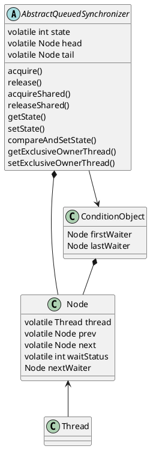

# AbstractQueuedSynchronizer

通过一个原子整数和FIFO队列，以及围绕它们的原子操作，实现了同步器该有的基本功能。原子整数`state`是个抽象的同步资源的概念，基本流程都是围绕着资源的`acquire()`与`release()`进行的，子类需要按需实现以下方法：
* `tryAcquire()`
* `tryRelease()`
* `tryAcquireShared()`
* `tryReleaseShared()`
* `isHeldExclusively()`

关于FIFO队列：
* 节点`Node`有以下几种`waitStatus`：
    * 0：初始状态；某个节点的后继将要被唤醒时，其状态也会从`SIGNAL`改回0（可能是防止有并发的多余的唤醒操作？）
    * `CANCELLED`：表示对应的线程已放弃获取资源（发生异常、获取超时时设置）
    * `SIGNAL`：表示该节点移出队列时，需要唤醒后继节点关联的线程（新节点加入队列时会修改前驱节点的状态）
    * `CONDITION`：TODO
    * `PROPAGATE`：TODO
* 头结点`head`和尾节点`tail`默认为`null`
* 首次插入节点时，用一个假节点作为头结点，被插入的节点链在假节点之后
* 头节点的状态必然不是`CANCEL`
* 头节点不属于队列的一部分，被设为`head`的节点等同于移出队列，`thread`与`prev`引用会重置为`null`，其他属性保留（失去头节点身份时才重置`next`）
* 队头实际上是头结点的直接后继节点
* 某个节点取消获取同步资源时，会设置`waitStatus`为`CANCEL`，并更新其前驱非`CANCEL`节点的后继节点引用，但不会马上更新其后继节点的前驱节点引用
    * 因为有并发取消的可能，从某个节点开始寻找其后继的首个有效节点时，如果发现该节点的直接后继节点已经是`CANCEL`状态，需要从`tail`开始往前找
    * 在适当的时机，再遍历前驱节点，找到首个非`CANCEL`状态的节点，并修正当前节点的前驱节点引用

`acquire()`的流程如下：
* 先尝试`tryAcquire`，如果失败再考虑排队
* 建立一个节点，标记为独占模式，CAS操作插入队列末尾
* 开始循环：
    * 检查自己是否已排到队头（即直接前驱节点是`head`）
    * 如果自己已排到队头，再次`tryAcquire`；如果成功，将自己设为`head`（即移出队列），跳出循环
    * 如果没有排到队头，或是`tryAcquire`失败，检查前驱节点并挂起当前线程
        * 如果直接前驱节点是`SIGNAL`状态，直接挂起当前线程
        * 如果直接前驱节点是`CANCEL`状态，向前找到首个非`CANCEL`状态的节点，并修正当前节点的前驱节点引用；可能因此排到队头，不挂起当前线程
        * 否则将前驱节点的状态CAS更新为`SIGNAL`；可能前驱节点被并发取消，需要再次检查，不挂起当前线程

线程挂起后，只能等待其他线程释放同步资源时。如果是可中断的版本，从挂起状态恢复时需检查线程的中断标记，并按需抛出中断异常，调用`cancelAcquire`。如果是带超时参数的版本，在循环开始前记录时间戳，在循环过程中比较时间差，超时时调用`cancelAcquire`。

`cancelAcquire`的流程如下：`
* 检查并修正当前节点的前驱节点引用
* 将当前节点的`waitStatus`改成`CANCEL`
* 更新前驱节点的后继节点为当前节点的后继节点：
    * 如果当前节点是`tail`，直接CAS把前驱节点设为尾节点
    * 如果前驱节点是头结点，当前节点又被取消了，等同于后继节点排到了队头，因此直接唤醒后继节点
    * 如果再次检查前驱节点发现被取消，或是尝试CAS将状态改成`SIGNAL`失败（可能是并发取消），后继节点也可能排到了队头，因此也唤醒后继节点
    * 其他情况下更新前驱节点的后继节点引用

唤醒后继节点时，会尝试CAS将当前节点的`waitStatus`置0；后继节点唤醒后，按照`acquire`的流程会检查并刷新其前驱节点。

`release()`的流程：调用`tryRelease`，如果返回`true`，即所有同步资源都被释放了，唤醒队列中的首个非取消状态的节点（以头结点为基准，调用唤醒后继节点的流程）。

`acquireShared`的流程：
* 先尝试`tryAcquireShared`，如果失败再考虑排队
* 建立一个节点，标记为共享模式，CAS操作插入队列末尾
* 开始循环：
    * 检查自己是否已排到队头（即直接前驱节点是`head`）
    * 如果自己已排到队头，再次`tryAcquireShared`
        * 如果返回成功，将自己设为`head`（即移出队列）
        * 如果以下任意条件满足，且当前节点的后继节点也是共享模式，执行释放共享资源的流程（暂时没有后继节点时也尝试释放）：
            * `tryAcquireShared`返回的结果表示后续获取共享资源的操作可能成功
            * 原头节点为`null`，或是原头节点的`waitStatus`小于0（TODO：什么情况？）
            * 当前头节点为`null`，或是当前头节点的`waitStatus`小于0（TODO：什么情况？）
        * 跳出循环
    * 如果没有排到队头，或是`tryAcquire`失败，执行检查前驱节点并挂起当前线程的流程

`releaseShared`的流程：
* TODO

## ReentrantLock
拿锁操作即`acquire(1)`拿一个同步资源；`tryAcquire`时，先检查瞬时状态判断当前是否有线程已拿锁：
* 如果没人拿锁，非公平锁直接尝试CAS操作修改给`state`加一，公平锁则是先检查队列中没有其他排队的节点后才尝试CAS；CAS成功则标记当前线程独占同步器
* 如果有人拿锁且正是当前线程拿的锁，直接`setState(oldState + 1)`

放锁操作即`unlock(1)`释放一个同步资源；`tryRelease`时，给`state`减一；如果减到0了，则当前线程不再持有锁，清除独占标记。

## ReentrantReadWriteLock

