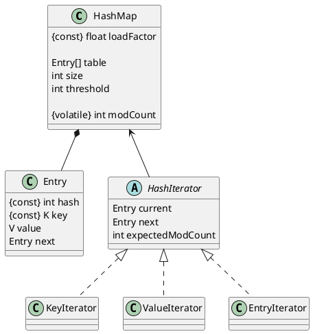
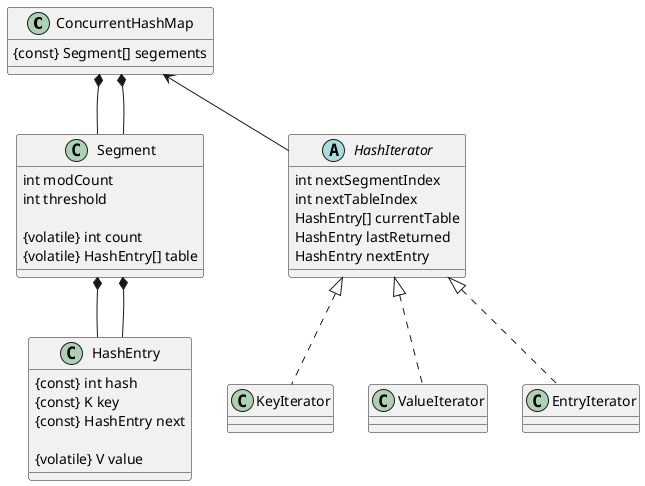
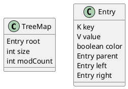

# HashMap

JDK6的`HashMap`就是N个`Entry`单向链表构成的数组，`哈希值 & table.length`即得到对应的数组下标。`table[i]`保存的是最近一次插入的`Entry`节点，即最早插入的节点在链表的末尾。

为了加快检索速度，减少对`Entry`链表的遍历，`loadFactor`控制哈希表中实际元素个数与`table`数组长度的比例。当实际元素个数超过`table.length`时，开一个2倍原长度的新`table`，并将原有元素转移过去。

`modCount`在`HashMap`结构发生变化之前做自加操作；每次新开一个迭代器时，会记录当时的`modCount`，每次取下一个元素时，会比较`modCount`是否变动以便`fail-fast`。


# LinkedHashMap
```plantuml
@startuml
class LinkedHashMap {
    boolean accessOrder
    LinkedHashMap.Entry header
}
class LinkedHashMap.Entry {
    LinkedHashMap.Entry before
    LinkedHashMap.Entry after
}
HashMap <|-- LinkedHashMap
HashMap.Entry <|-- LinkedHashMap.Entry
@enduml
```
`LinkedHashMap`是`HashMap`的子类，在`HashMap`的基础上按元素插入顺序维护了一个`Entry`链表。其内部类`Entry`是`HashMap.Entry`的子类，多加两个变量构成记录元素插入顺序的双向链表结构。

另外，`LinkedHashMap`可用作LRU，也支持按照元素的访问顺序维护`Entry`链表，即`get`操作会把节点移动到链表前端。支持在插入新元素时移除“最旧”的元素。


# ConcurrentHashMap

JDK6的`ConcurrentHashMap`是由多个`Segment`构成的整体，`Segment`的数量由参数`concurrencyLevel`决定，`(哈希值 >> segmentShift) & segmentMask`可得到某个元素对应的数组下标。`Segment`作为一个`ReentrantLock`，实现了哈希表的功能。

`put`和`remove`操作需要先拿每个`Segment`的锁。因为链表结构`HashEntry`中下一节点引用是个`final`值，当链表结构发生变更时，需要复制部分节点重建链表结构，但因此`get`操作可以不拿锁。

一些需要跨多个`Segment`的查询操作（`size`、`containsValue`等）在默认情况下先尝试不拿锁进行，通过操作前后统计每个`Segment#modCount`之和是否变化决定是否理解返回结果，如果有并行的结构修改，则需锁住所有`Segment`再执行。这里有一个骚操作：`Segment`的版本号`modCount`是普通变量，元素数量`count`是个`volatile`变量，当元素数量改变时，先改`modCount`再改`count`，建立`happens-before`关系；不拿锁检查是否有并发修改时，先读一下`count`再取`modCount`，保证取出的`modCount`是当时最新的值。

`ConcurrentHashMap`在迭代时不会`fail-fast`，在构造时、迭代过程中切换`Segment`时会保存当时的`Segement#table`引用（即保存了旧的链表），因此链表结构并发改变也不会影响迭代过程。调用`remove`方法时会调用`ConcurrentHashMap.remove`拿`Segment`锁进行正常的移除流程。


# TreeMap

基于红黑树的实现，不用算哈希，因为可以通过比较key的大小找到元素位置。


# JDK1.8的改变
在JDK8中，`HashMap`的`table`是一个`Node`数组，保存的`Node`引用可以是个链表头节点或者红黑树节点（可能不是根节点）。当`HashMap`的容量超过一定值`MIN_TREEIFY_CAPACITY`，如果插入操作使某个`Node`链表长度超过`TREEIFY_THRESHOLD`，链表会转成红黑树结构；如果删除操作使红黑树容量小于`UNTREEIFY_THRESHOLD`，红黑树转回链表。

`ConcurrentHashMap`的`Segment`也有相同的节点转换机制。