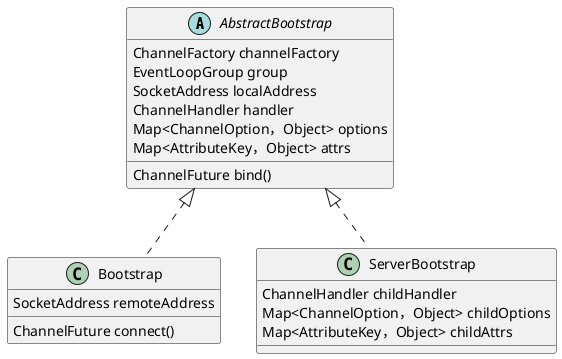
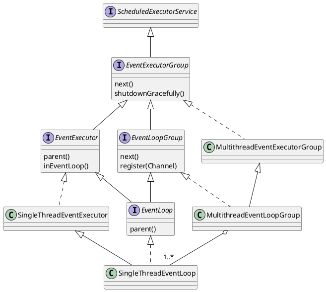
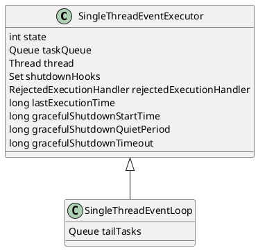
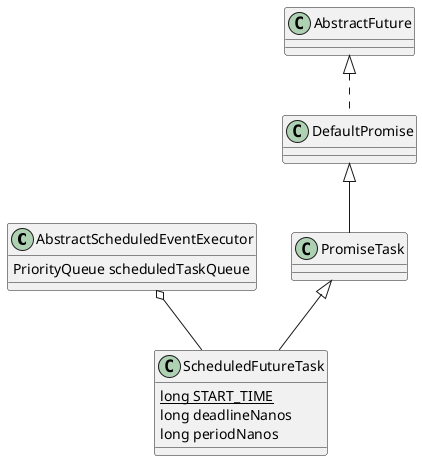
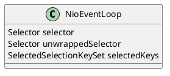
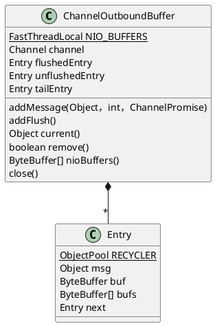
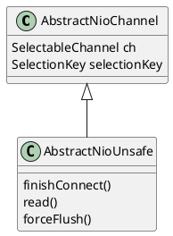
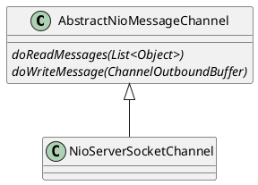
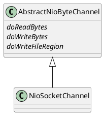
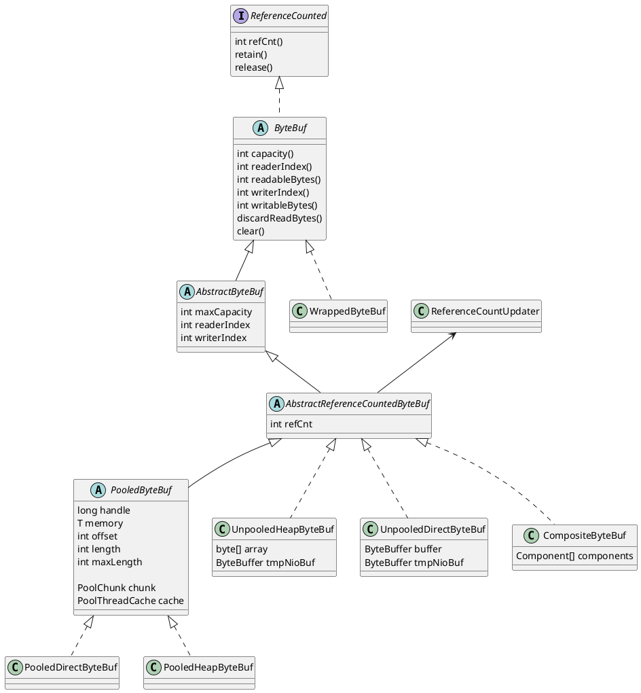

# Netty学习笔记

## Netty的基本组件
* `Bootstrap` / `ServerBootstrap`：负责整合其他组件以建立连接
* `EventLoop`：单线程的事件循环
* `EventLoopGroup`：单个或多个事件循环的集合
* `Channel`：对`java.nio.channels.Channel`进行了封装
* `ChannelHandler`：负责处理`Channel`中各种输入输出事件的单元，有专门处理某一方向事件的子接口`ChannelInboundHandler`与`ChannelOutboundHandler`
* `ChannelPipeline`：多个`ChannelHandler`组成的流水线队列，对于输入事件按正向交给其中的`ChannelInboundHandler`进行处理，对于输出事件按反向交给其中的`ChannelOutboundHandler`处理


## Bootstrap / ServerBootstrap

整合Netty中的各种基本组件，从而建立连接、开启`Channel`的辅助类。


## EventLoop / EventExecutor (EventLoopGroup / EventExecutorGroup)

`EventLoop`即事件循环，以单线程来处理Netty中的各种I/O事件。一个`EventLoop`固定对应一个线程，管理一个或多个`Channel`。

`EventLoopGroup`是一组`EventLoop`，但`EventLoop`本身也是一个`EventLoopGroup`。

`EventLoop`继承了`EventExecutor`。类似的，`EventExecutorGroup`是一组`EventExecutor`，`EventExecutor`本身也是一个`EventExecutorGroup`。`EventLoopGroup`与`EventExecutorGroup`提供了`next`方法，从管理的一组对象中获得其中某个`EventLoop`或`EventExecutor`（一般采用轮转的选择方法）。

`EventExecutorGroup`继承了`ScheduledExecutorService`，即提供了安排线程执行定时、非定时、周期、非周期异步任务的功能。`EventLoopGroup`在其基础上提供了注册`Channel`的功能。


### MultithreadEventExecutorGroup
构造方法时可指定线程数量、线程工厂、`Executor`的选择策略工厂、`Executor`的附加参数等。

在构造时，会按照指定的线程数量调用多次`newChild`方法，创建相应数量的`EventExecutor`（此时还未创建同等数量的线程）。默认情况下，向被创建的`EventExecutor`传入`ThreadPerTaskExecutor`供其包装用。`ThreadPerTaskExecutor`每执行一个任务，使用线程工厂创建一个新的线程（`EventExecutor`只在初始化时利用`ThreadPerTaskExecutor`执行一个任务，即只创建一个线程）。

默认的Executor选择策略为轮转法；如果线程数量是2的N次幂，则用位操作替代加一取余。


### SingleThreadEventLoop与SingleThreadEventExecutor

`SingleThreadEventLoop`是实现`EventLoop`的主要抽象基类，其核心是`SingleThreadEventExecutor`。在`SingleThreadEventExecutor`的基础上，`SingleThreadEventLoop`提供了注册`Channel`的方法、维护了一个在每次事件循环迭代结束时执行的任务队列。多个`SingleThreadEventLoop`组成`MultithreadEventLoopGroup`，多个`SingleThreadEventExecutor`组成`MultithreadEventExecutorGroup`。

`SingleThreadEventExecutor`实际上是另一个`Executor`对象的代理，该对象在`SingleThreadEventExecutor`构造时由`MultithreadEventExecutorGroup`传入。默认传入的是`ThreadPerTaskExecutor`，每执行一个任务会创建一个新的线程，实际上`SingleThreadEventExecutor`只调用`ThreadPerTaskExecutor`一次，执行事件循环逻辑。`SingleThreadEventExecutor`对传入的`Executor`对象进行了包装，确保由其执行的`Runnable`可以通过`ThreadExecutorMap#currentExecutor`拿到该`SingleThreadEventExecutor`自身。

`SingleThreadEventExecutor`的状态：
* `ST_NOT_STARTED`：初始状态，未绑定任何线程
* `ST_STARTED`：事件循环已开始，已绑定某个某个线程
* `ST_SHUTTING_DOWN`：事件循环正在关闭中，在配置的时间段内仍可接受新任务
* `ST_SHUTDOWN`：事件循环已关闭，还需执行所有剩余任务、`shutdownHooks`、`cleanup`方法定义的清理逻辑
* `ST_TERMINATED`：事件循环已彻底关闭

`SingleThreadEventExecutor`的生命周期：
* 在`ST_NOT_STARTED`状态下，外部首次调用`execute`方法时，进行初始化，状态切换为`ST_STARTED`
    * 使用构造时`MultithreadEventExecutorGroup`传入的`executor`执行任务；默认的`ThreadPerTaskExecutor`在此时会创建一个新线程
    * 绑定新创建的线程与`SingleThreadEventExecutor`
    * 调用可由子类覆盖的抽象方法`run`（由子类实现事件循环逻辑）
* 在`ST_STARTED`状态下，如果在绑定的线程中执行的`run`方法正常返回（执行成功），或是抛出了异常（执行失败），状态切换为`ST_SHUTTING_DOWN`
* 在`ST_SHUTTING_DOWN`状态下：
    * 取消所有定时任务，但是仍保留在定时任务队列中
    * 初始化`gracefulShutdownStartTime`
    * 执行所有剩余的任务
        * 从定时任务队列中取出当前已超时的任务，放入正常任务队列中，直至定时任务队列中没有满足条件的任务，或是正常任务队列已满
        * 从正常任务队列中取出所有任务，逐一执行
        * 调用可覆盖的`afterRunningAllTasks`方法（例如：执行所有`tailTasks`）
        * 如果有未能放入正常任务队列的可执行定时任务，重复以上流程
    * 执行所有`shutdownHooks`
    * 如果当前时间距`gracefulShutdownStartTime`已超过了`gracefulShutdownTimeout`，状态切换到`ST_SHUTDOWN`
    * 如果当前时间距`lastExecutionTime`不超过`gracefulShutdownQuietPeriod`，每隔100`ms`重复以上流程检查是否有新任务提交，否则状态切换到`ST_SHUTDOWN`
* 在`ST_SHUTDOWN`状态，不再接受新任务
    * 最后一次的检查并执行队列中的剩余任务（包括已超时的定时任务）、`shutdownHooks`等
    * 调用可覆盖的`cleanup`方法执行清理逻辑（由子类实现）
    * 状态切换到`ST_TERMINATED`

调用`execute`方法执行任务的流程：
* 如果当前状态已转移到`ST_SHUTDOWN`之后，直接拒绝任务并抛出拒绝执行异常
* 向`taskQueue`中提交要执行的任务；如果`taskQueue`已满，调用`rejectedExecutionHandler`处理
* 如果调用者所在线程不是事件循环绑定的线程：
    * 检查是否需要对`SingleThreadEventExecutor`进行初始化
    * （因为`taskQueue#offer`可能阻塞线程）如果当前状态已转移到`ST_SHUTDOWN`之后，尝试从`taskQueue`中移除该任务；如果移除失败，说明任务已在事件循环中执行；如果移除成功，抛出拒绝执行异常

事件循环内部调用`takeTask`方法获取下一个要执行的任务的流程：
* `peek`定时任务队列中的首个任务
* 如果没有定时任务，从普通任务队列中获取一个任务（阻塞线程；特定的操作会向普通队列里加一个`WAKEUP_TASK`唤醒线程）
* 如果有定时任务：
    * 如果定时任务未超时，依然先从普通任务队列中获取一个任务，但是最多等待首个定时任务的超时时长
    * 如果定时任务已超时，或是等待指定时间后没有拿到普通任务，检查定时任务队列并将所有已超时的任务移入普通任务队列中，再从普通任务队列中取一个任务（防止普通任务队列中总有任务，而定时任务总是无法得到执行）

`SingleThreadEventExecutor`不赞成使用`ExecutorService`的`shutdown`、`shutdownNow`接口，需调用`shutdownGracefully`来关闭事件循环；可指定以下参数：
* `quietPeriod`：一个时间段，在关闭过程中这个时段内可以提交的任务；如果该时段内没有任何任务提交，事件循环将切换到`ST_SHUTDOWN`状态；如果时段内有任务提交，会重新开始计时
* `timeout`：如果距开始关闭的时间超过了指定的超时时长，事件循环将切换到`ST_SHUTDOWN`状态
流程如下：
* 检查参数有效性：```quietPeriod >= 0 && quietPeriod <= timeout```
* 如果当前状态已时`ST_SHUTTING_DOWN`之后，直接返回`terminationFuture`
* 循环直至CAS操作成功：将状态从当前值修改为`ST_SHUTTING_DOWN`；如果当前值已是`ST_SHUTTING_DOWN`之后，则保持状态不变
* 将传入的参数转化写入`gracefulShutdownQuietPeriod`、`gracefulShutdownTimeout`
* 如果事件循环尚未初始化（CAS操作时旧状态是`ST_NOT_STARTED`状态），则执行线程初始化流程，再执行关闭流程


### AbstractScheduledEventExecutor与ScheduledFutureTask

`AbstractScheduledEventExecutor`是`SingleThreadEventExecutor`的父类，提供执行定时任务的功能，使用一个`PriorityQueue`保存已提交的定时任务（这个队列只在事件循环中访问）。`ScheduledFutureTask`是`Netty`的定时任务类。

`ScheduledFutureTask`的成员变量`deadlineNanos`记录任务超时的相对纳秒时间；如果是固定频率或固定延迟的周期任务，`periodNanos`非0。

`ScheduledFutureTask#run`的流程：
* 确保在事件循环中执行
* 首先确认该定时任务是否已超时，因为任务在提交到事件循环，或是被取消时会提前执行
    * 如果任务已被取消（检查`isCancelled`），将其从定时任务队列中移除
    * 否则就是刚提交的状态，将其加入定时任务队列中
* 如果已超时：
    * 若任务未取消，则在事件循环中执行传入的`Runnable`
    * 如果是周期任务，更新`deadlineNanos`并将该任务重新加入队列

`ScheduledFutureTask#cancel`的流程：
* CAS操作修改任务状态
* 如果CAS操作成功：
    * 如果当前在事件循环中，直接操作定时任务队列
    * 否则调用关联的scheduledExecutor的`execute`方法（在事件循环中执行时再从定时队列中移除）

`AbstractScheduledEventExecutor#pollScheduledTask`，从定时任务队列中取出在指定的时间可以执行的任务：
* `peek`队列中的首个任务，检查其超时时间
* 如果与指定时间比已超时，将其从队列中移除

`AbstractScheduledEventExecutor#schedule`，安排定时任务：
* 用给定的`Runnable`构造一个`ScheduledFutureTask<Void>`，或是用给定的`Callable<V>`，构造一个`ScheduledFutureTask<V>`
* 如果当前在事件循环中，直接将任务插入定时队列，否则调用`execute`方法执行该任务（在事件循环中执行时再插入定时队列）


### DefaultEventLoop
`DefaultEventLoop`是最简单的`EventLoop`实现，它的`run`方法流程如下：
* 循环：
    * 取任务（`SingleThreadEventExecutor#takeTask`）
    * 执行任务并更新`lastExecutionTime`
    * 检查事件循环是否被关闭，并进行相关处理（`SingleThreadEventExecutor#confirmShutdown`）


### NioEventLoop

`NioEventLoop`在`SingleThreadEventLoop`的基础上，维护了一个`Selector`对象，支持注册`Channel`，以便在这个事件循环中实现多路互用。

`NioEventLoop`在构造时使用传入的`SelectorProvider`打开一个selector，存为成员变量`unwrappedSelector`，同时会尝试用`SelectedSelectionKeySetSelector`对其进行包装，存为成员变量`selector`，同时`unwrappedSelector`的`selectedKeys`通过反射替换成一个`SelectedSelectionKeySet`实例（基于数组的`Set<SelectionKey>`实现）。`SelectedSelectionKeySetSelector`对普通的`Selector`进行代理，在调用`select`、`selectoNow`方法前都会清空被代理的`Selector#selectedKeys`（因此`SelectedSelectionKeySet`无需计算哈希值）。

`NioEventLoop#run`的流程：
* 进行select操作：
    * 如果事件循环中有普通任务，调用无阻塞`selectorNow()`
    * 如果事件循环中没有普通任务，但有定时任务，根据最早触发的定时任务的超时时长调用`select(long)`
    * 如果事件循环中无任何任务，调用阻塞的`select()`
* 在select操作之后，按照设置的`ioRatio`分配时间调用`processSelectedKeys`和`runAllTasks`；如果没有select到任何key，以最短的时间执行队列中的其他任务（调用`processSelectedKeys`前后记录用时；`runAllTasks`方法支持参数控制执行最大时长）
* 检查事件循环是否被关闭，如果是，在执行通用关闭流程前，关闭所有关联的`Channel`、取消所有的`SelectionKey`等

在select的过程中，局部变量`selectCnt`用于检测是否发生了空轮询的情况（`selector.select()`时提前返回多次），如果是，通过重建selector、重新关联所有Channel来进行修正。

`NioEventLoop#processSelectedKeys`的流程：
* 遍历`selectedKeys`（普通selector的是个`HashSet`，优化版的是`SelectedSelectionKeySet`），根据`key.attachment()`的类型分别处理：
    * 如果是`NioTask`：调用`NioTask#channelReady`；如果发生错误则调用取消该key，调用`NioTask#channelUnregistered`；最后再检查一遍key是否有效，如果无效也立即调用`NioTask#channelUnregistered`
    * 如果是`AbstractNioChannel`，根据`key.readyOps()`，调用`AbstractNioChannel.NioUnsafe`对象的相关方法，处理完成连接、读、写等操作

由于`NioEveltLoop`会在调用`Selector#select()`、`Selector#select(long)`时阻塞线程，因此`NioEventLoop#wakeup`调用了`Selector#wakeup`以中断select操作、唤醒线程。


## Channel / AbstractChannel / Unsafe / AbstractUnsafe

Netty提供了`Channel`，对socket连接进行封装，有以下特征：
* 提供了各种I/O操作的方法，且这些方法都是异步的
* 可以关联到某个事件循环，并在这个事件循环中处理I/O事件
* 所有I/O事件交由关联的`ChannelPipeline`按照特定的顺序进行处理
* 所有非安全操作交由关联的`Unsafe`对象代理执行
* 提供一个`CloseFuture`，在关闭时执行注册的回调

`AbstractChannel`是该接口的基础实现，所有的非`do`开头的I/O操作方法都是交给`ChannelPipeline`分配给其中的`ChannelHandler`负责处理；所有`do`开头的抽象I/O方法，供内置的`Unsafe`对象调用，由子类实现负责进行实际的I/O操作。`Unsafe`对象的各种“公开”方法并不对用户公开，仅供Netty内部使用（如事件循环处理`selectedKeys`）。

`AbstractUnsafe`是`AbstractChannel`的内部类，负责执行各种“不安全”的I/O操作。大部分操作需要在关联的事件循环中执行（除注册到事件循环），基本流程都是按需修改成员变量、调用`AbstractChannel#doXXX`、调用`ChannelPipeline`的相关方法处理相关的I/O事件。`AbstractUnsafe`没有给出`connect`方法的基础实现，因为只有特定类型的`Channel`才支持该方法。


### ChannelOutboundBuffer

`AbstractUnsafe`使用`ChannelOutboundBuffer`缓存要发送的数据，在传入要发送的数据时，会调用可由子类覆盖的方法对数据进行过滤处理。

`ChannelOutboundBuffer`将每个待发送的数据被封装在`Entry`对象中，多个`Entry`形成一个链表结构。`ChannelOutboundBuffer`维护了三种特殊节点的引用：
* `flushedEntry`：指向链表的首个待发送的节点
* `unflushedEntry`：指向链表的首个未发送的节点
* `tailEntry`：指向链表末端节点

`Entry`列表结构大致为：
```Entry(flushedEntry) --> ... Entry(unflushedEntry) --> ... Entry(tailEntry)```。

所有`Entry`对象受一个对象池管理，通过`newInstance`方法从对象池中取出一个可用对象以构造新的`Entry`对象，通过`recycle`方法回收被移除的`Entry`对象。

在调用`AbstractUnsafe#write`写入数据时，会调用`addMessage`缓存待发送的消息对象：
* 将传入的消息对象包装成`Entry`
* 将`Entry`插入链表末端，按需更新三个`Entry`引用
* 如果缓存的总数据大小超过配置值，调用`ChannelPipeline`相关方法处理缓存不可继续写入事件

在调用`AbstractUnsafe#flush`方法发送已缓存的数据时，会调用`addFlush`将链表中所有`Entry`对象标记为待发送状态，最后由`AbstractChannel#doWrite`负责从`ChannelOutboundBuffer`中取数据、发数据、清除已发送的数据。

调用`remove`发法会移除首个待发送的`Entry`对象，被移除的对象由对象池回收，移除完成后会检查缓存中总数据大小，根据配置可能会调用`ChannelPipeline`的相关方法处理缓存恢复可写入状态。

`NioSocketChannel`在发送数据时，需要将所有数据放在`ByteBuffer`中，会调用`nioBuffers`方法，令所有数据类型为`ByteBuf`的待发送`Entry`构造对等的`ByteBuffer`对象。


### RecvByteBufAllocator
```plantuml
@startuml
interface RecvByteBufAllocator
interface RecvByteBufAllocator.Handle {
    ByteBuf allocate(ByteBufAllocator)
    reset(ChannelConfig)
    incMessagesRead(int)
    attemptedBytesRead(int)
    lastBytesRead(int)
    boolean continueReading()
    readComplete()
}

interface MaxBytesRecvByteBufAllocator {
    maxBytesPerRead(int)
    maxBytesPerIndividualRead(int)
}
interface MaxMessagesRecvByteBufAllocator {
    maxMessagesPerRead(int)
}


RecvByteBufAllocator --> RecvByteBufAllocator.Handle
RecvByteBufAllocator <|-- MaxBytesRecvByteBufAllocator
RecvByteBufAllocator <|-- MaxMessagesRecvByteBufAllocator

MaxBytesRecvByteBufAllocator <|.. DefaultMaxBytesRecvByteBufAllocator

MaxMessagesRecvByteBufAllocator <|.. DefaultMaxMessagesRecvByteBufAllocator
DefaultMaxMessagesRecvByteBufAllocator <|-- FixedRecvByteBufAllocator
DefaultMaxMessagesRecvByteBufAllocator <|-- AdaptiveRecvByteBufAllocator
@enduml
```
`AbstractUnsafe`使用`RecvByteBufAllocator.Handle`管理分配接收数据的缓存，主要的目标是分配的缓存大小能刚好存下所有待接收的数据。

`RecvByteBufAllocator.Handler`通过以下方法收集某次读取操作相关的数量信息：
* `reset`：在一次读取操作开始前重置相关计数
* `incMessagesRead`：增加已读消息数量
* `attemptedBytesRead`：记录准备读取的字节数
* `lastBytesRead`：记录实际读取的字节数

`RecvByteBufAllocator.Handler`提供`allocate`方法分配一个大小“恰好”的数据接收缓存。

`RecvByteBufAllocator.Handler`提供`continueReading`方法控制读取操作的循环流程是否应该继续执行。

一般的使用流程为：
* 调用`NioUnsafe#read`开始一次读取操作
* 在准备阶段调用`reset`
* 开始读取循环
    * 调用`allocate`分配一个`ByteBuf`
    * 根据`ByteBuf#writableBytes`，调用`attemptedBytesRead`记录准备读取的字节数
    * 将待接收数据读入`ByteBuf`中，根据实际读取的字节数调用`lastBytesRead`进行记录
    * 如果读取到的字节数大于0，调用`incMessagesRead`记录读到的消息数
    * 调用`continueReading`判断是否继续循环
* 跳出循环后，调用`readComplete`做善后处理

`RecvByteBufAllocator`有两个子接口：
* `MaxBytesRecvByteBufAllocator`：按字节数控制每次接收数据的大小
* `MaxMessagesRecvByteBufAllocator`：按消息对象数控制每次接收数据的大小

`DefaultMaxBytesRecvByteBufAllocator`是`MaxBytesRecvByteBufAllocator`的默认实现，每次分配的`ByteBuf`大小取`min(每次循环最多读取的字节数，整个读取过程剩余待读取字节数)`。判断是否继续循环过程的依据是： 整个读取过程中已读字节数小于给定的上限值，且上一次试图读取的字节数等于实际读取的字节数（即可能还有待读取的数据）

`DefaultMaxMessagesRecvByteBufAllocator`是`MaxMessagesRecvByteBufAllocator`的默认抽象实现。有两个子类：
* `FixedRecvByteBufAllocator`：按固定的大小分配`ByteBuf`
* `AdaptiveRecvByteBufAllocator`
    * 初始化时，将给定的缓存大小范围划分为多个档次，构成一个缓存大小数组，选定一个值为初始分配的缓存大小
    * 提供一个`record`方法记录实际读取到的字节数，根据大小关系动态调整下次分配的缓存大小
        * 如果单次循环中读取到的数据能填满缓存，调用`lastBytesRead`做记录时时，需要调用`record`调整下次分配的缓存大小
        * 调用`readComplete`时，记录本次读取操作获得的总字节数，并据此调整下次分配的缓存大小


### AbstractNioChannel / NioUnSafe / AbstractNioUnsafe

`AbstractNioChannel`是基于`Selector`的`Channel`抽象类，包含部分`doXXX`方法的基础实现。`NioUnsafe`在`Unsafe`基础上增加了`read`、`finishConnect`、`forceFlush`等方法。

`AbstractNioChannel#doRegister`方法将包装的`SelectableChannel`与指定的`NioEventLoop#unwrappedSelector`进行注册，初始状态下`interestOps`为0；`AbstractNioChannel`会保存得到的`SelectionKey`引用。

`AbstractNioChannel#doDeregister`方法即`SelectionKey#cancel`（实际调用了`NioEventLoop#cancel`，会更新`NioEventLoop`的有关计数）。

`AbstractNioChannel#doBeginRead`方法将`SelectionKey#interestOps`与构造时传入的`readInterestOps`进行或操作并更新（`readInterestOps`由子类决定，可能是`OP_READ`或`OP_ACCEPT`）


### AbstractNioMessageChannel / NioMessageUnsafe
`AbstractNioMessageChannel`是基于某种消息对象的`AbstractNioChannel`基础抽象类，提供了两个抽象方法供子类实现负责消息消息的读写：
* `doReadMessages`
* `doWriteMessage`

`AbstractNioMessageChannel`实现了`AbstractChannel#doWrite`：
* 从发送缓存中取出一个消息对象（`ChannelOutboundBuffer#current`），如果无，则修改`SelectionKey#interestOps`，取消`OP_WRITE`标记
* 调用由子类实现的`doWriteMessage`完成对象的序列化与具体的发送过程，最多重试配置的自旋次数直至写入成功（`ChannelConfig#writeSpinCount`）
* 如果写入成功，将消息对象从发送缓存中移除
* 如果写入失败，确保`SelectionKey#interestOps`中包含`OP_WRITE`，等待下次写入机会
* 循环重复以上过程，直至发送缓存中无内容或是发生写入失败的情况

`NioMessageUnsafe`实现了`NioUnsafe#read`：
* 调用由`AbstractNioMessageChannel`子类实现的`doReadMessages`方法（由子类反序列化消息），将消息对象读入一个消息对象列表中
* 重复以上流程，直至无消息可读，或是Channel已关闭，或是`RecvByteBufAllocator.Handle`决定跳出读取循环，或是捕获到异常
* 调用`ChannelPipeline`相关方法处理读到的数据


### NioServerSocketChannel

`NioServerSocketChannel`是`AbstractNioMessageChannel`的一个子类，它的`readInterestOps`是`OP_ACCEPT`；当有消息“可读”时，它的`doReadMessages`方法从关联的`ServerSocketChannel`处接受到一个`SocketChannel`，并包装为`NioSocketChannel`作为“读取”到的消息对象。


### AbstractNioByteChannel / NioByteUnsafe
`AbstractNioByteChannel`是基于字节流的`AbstractNioChannel`基础抽象类，提供了一下抽象方法供子类实现负责消息的读写：
* `doReadBytes`
* `doWriteBytes`
* `doWriteFileRegion`

`AbstractNioByteChannel`实现了`AbstractChannel#doWrite`：
* 从发送缓存中取出一个对象（`ChannelOutboundBuffer#current`），如果无，则修改`SelectionKey#interestOps`，取消`OP_WRITE`标记
* 根据所取对象的类型，调用子类实现的`doWriteBytes`（`ByteBuf`）或`doWriteFileRegion`（`FileRegion`）方法；当`ByteBuf`或`FileRegion`的内容全部写完时，将其从发送缓存中移除
* 循环重复以上步骤，直至发送缓存为空提前返回，或是尝试的写操作次数达到了配置的自旋次数（`ChannelConfig#writeSpinCount`）

`NioByteUnsafe`实现了`NioUnsafe#read`：
* 使用`RecvByteBufAllocator.Handle`分配一个`ByteBuf`准备缓存接收到的数据
* 调用由子类实现的`doReadBytes`方法将数据读入`ByteBuf`中
* 如果读到的数据长度非0（Channel也没被关闭），调用`ChannelPipeline`相关方法处理读到的数据
* 重复以上步骤，直至无数据可读，或是Channel已关闭，或是`RecvByteBufAllocator.Handle`决定跳出循环，或是捕获到异常
* 跳出循环后，调用`ChannelPipeline`相关方法读取完成事件
* 如果发现Channel已关闭，调用`AbstractUnsafe#close`执行相关的清理
* 如果捕获到异常，进行如下处理：
    * 如果捕获异常前`ByteBuf`已读取到数据，先调用`ChannelPipeline`相关方法处理读到的数据
    * 调用`ChannelPipeline`处理捕获到的异常
    * 如果捕获异常前Channel已关闭，或是发生了`IOException`，调用`AbstractUnsafe#close`执行相关的清理


### NioSocketChannel

`NioSocketChannel`是`AbstractNioByteChannel`的一个子类。除了`shutdown`外，`NioSocketChannel`提供`shutdownInput`或`shutdownOutput`关闭某个方向的通信。`doXXX`方法的实现基本是操作`SocketChannel`、`SelectionKey`、`ByteBuf`、`ByteBuffer`相关。

`doConnect`方法的实现：
* 先绑定本地地址（`SocketChannel#bind`或`Socket#bind`）
* 调用`SocketChannel#connect`或`Socket#connect`
* 如果没有立即返回成功，在`SelectionKey#interestOps`中设置`OP_CONNECT`（后续再调用`SocketChannel#finishConnect`方法）
* 如果发生异常，关闭Channel

`doReadBytes`方法的实现：`ByteBuf#writeBytes`。

`doWriteBytes`方法的实现：`ByteBuf#readBytes`。

`doWriteFileRegion`方法的实现：`FileRegion#transferTo`。

`doWrite`方法的实现：
* 如果发送缓存中无数据，清除`SelectionKey#interestOps`中的`OP_WRITE`并直接返回
* 如果发送缓存中待写入的数据全是`ByteBuf`类型，将其转换成direct内存区的`java.nio.ByteBuffer`（如果是`DirectByteBuf`，可以减少一次数据拷贝）
    * 统计待写数据长度
    * 调用`SocketChannel#write`，得到实际写入的数据长度（如果写入数据长度非正数，提前返回并确保`SelectionKey#interestOps`中有`OP_WRITE`，等待下次写入机会）
    * 根据实际写入的数据长度清理发送缓存（移除），并调整单次写入所允许的最大字节数（根据注释，某些OS的发送缓存大小可变）
    * 记录一次写操作
* 否则调用`AbstractiNioByteChannel#doWrite0`方法发送缓存中的第一条数据，并统计写操作的次数
* 循环执行以上流程，直至发送缓存中无数据，或是写操作次数超过配置的自旋次数（`ChannelConfig#writeSpinCount`）


## ChannelPipeline
```plantuml
@startuml
interface Channel
interface ChannelPipeline {
    addXXX(ChannelHandler)
    removeXXX(ChannelHandler)
    fireXXX()
    xxx()
}
class DefaultChannelPipeline {
    HeadContext head
    TailContext tail
}

interface ChannelHandlerContext
stract class AbstractChannelHandlerContext {
    AbstractChannelHandlerContext prev
    AbstractChannelHandlerContext next
}
class DefaultChannelHandlerContext {
    ChannelHandler handler
}
interface ChannelHandler
interface ChannelInboundHandler
interface ChannelOutboundHandler

Channel <--> ChannelPipelin
ChannelPipeline <|.. DefaultChannelPipeline
DefaultChannelPipeline  *--  ChannelHandlerContext
ChannelHandlerContext <|.. AbstractChannelHandlerContext
AbstractChannelHandlerContext <|.. DefaultChannelHandlerContext
DefaultChannelHandlerContext  --> ChannelHandler
ChannelHandler <|-- ChannelInboundHandler
ChannelHandler <|-- ChannelOutboundHandler
@enduml
```
`ChannelPipeline`顾名思义是一个`Channel`的`ChannelHandler`流水线，默认实现为`DefaultChannelPipeline`。当一个`ChannelHandler`被加入`ChannelPipeline`时，会创建一个关联的`ChannelHandlerContext`对象，其抽象实现`AbstractChannelHandlerContext`有着链表节点的结构。因此`DefaultChannelPipeline`通过头尾两个节点的`AbstractChannelHandlerContext`成员变量维护了一个双向链表，从而存储了所有`ChannelHandler`。

一个I/O事件，会在`ChannelPipeline`中流动，按顺序被一个或多个`ChannelHandler`处理。根据方向，I/O事件会被一个`ChannelInboundHandler`或是`ChannelOutboundHandler`处理，并可以通过调用`ChannelHandlerContext#fireXXX`或`ChannelHandlerContext#xxx`交给流水线中下一个同类型的`ChannelHandler`继续处理。如果直接调用`ChannelPipeline#fireXXX`或`ChannelPipeline#xxx`，则是按以下规则从流水线中寻找第一个合适的`ChannelHandler`进行处理。

如果是输入事件，`ChannelPipeline`按正向寻找`ChannelInboundHandler`进行处理；如果是输出事件，`ChannelPipeline`按反向寻找`ChannelOutboundHandler`进行处理（这里的输出事件更准确的说是发出I/O请求，请求读取数据也是输出事件）。
```
Handlers = [InboundHandler, OutboundHandler, Inboundhandler, InboundHandler, OutboundHandler]
Inbound Event:  Socket  ->  Handlers[0] ->  Handlers[2] ->  Handlers[3]
Outbound Event: Request ->  Handlers[4] ->  Handlers[1] ->  Socket
```

在`ChannelPipeline`中添加`ChannelHandler`时，可指定`EventLoopGroup`，让`ChannelHandler`在其他线程中处理事件。此外，`ChannelHandler`可动态移除。


### DefaultChannelPipeline
`DefaultChannelPipeline`有两个固定的`ChannelHandlerContext`：
* `HeadContext` head
* `TailContext` tail
所有新加的`ChannelHandler`将插在这两个节点之间。

`HeadContext`附带实现了`ChannelInboundHandler`与`ChannelOutboundHandler`：
* 作为第一个处理输入事件的Handler，确保事件会被传递给下一个`ChannelInboundHandler`处理，并执行相关的初始化
* 作为最后一个处理输出事件的Handler，确保在最后调用`Unsafe`的相关方法执行I/O操作

`TailContext`附带实现了`ChannelInboundHandler`，确保了未处理的输入事件关联的数据最后能被释放（例如接收到的数据，可能在直接内存中）。


### AbstractChannelHandlerContext
`AbstractChannelHandlerContext`是`ChannelHandlerContext`的基础实现。每个`AbstractChannelHandlerContext`在构造时会根据关联的`ChannelHandler`的能力（是否实现了`ChannelInboundHandler`或`ChannelOutboundHandler`，相关的方法是否有`Skip`注解），生成一个掩码`executionMask`。在调用`fireXXX`或`xxx`方法时，便可根据I/O事件的方向与对应的掩码在链表中寻找下一个支持处理该事件的`ChannelHandlerContext`。找到下一个`ChannelHandlerContext`之后，便可对其关联的`ChannelHandler`调用相关方法处理I/O事件（如果下一个`ChannelHandlerContext`关联的事件循环与当前线程不一致，则是异步执行）。


## ByteBuf

`ByteBuf`是`java.nio.ByteBuffer`的替代。相较于`ByteBuffer`需要写完后要`flip`才能读，`ByteBuf`记录了两个控制读、写操作的下标变量（`readerIndex`、`writerIndex`），可以边读边写。两者满足关系：```0 <= readerIndex <= writerIndex <= capacity```。```0 - readerIndex```之间为已读、可丢弃的数据，```readerIndex - writerIndex```之间为可读取的数据，```readerIndex - writerIndex```之间为可写入的空间。

可以通过工具类`Unpooled`构造`ByteBuf`，如果在有`ByteBufAllocator`的环境中，也可以使用`ByteBufAllocator`分配`ByteBuf`（根据具体实现，可能会使用直接内存并受对象池管理）。

由于`ByteBuf`的具体实现可能使用到了直接内存，因此实现了`ReferenceCounted`接口，用来进行内存管理。`AbstractByteBuf`实现了数据操作的的框架，`AbstractReferenceCountedByteBuf`利用`ReferenceCountUpdater`实现了引用计数相关的基础功能。

`PooledByteBuf`是受对象池管理的`ByteBuf`，内存空间受`PoolArena`管理。实际分配的内存可能大于所需的内存，故使用两个成员变量`length`、`maxLength`记录空间大小。根据数据位置分为`PooledHeapByteBuf`与`PooledDirectByteBuf`，引用计数为0时，会调用`PoolArena`相关方法返还内存，对象本身也回收到对象池中。

`UnpooledHeapByteBuf`与`UnpooledDirectByteBuf`是不受对象池管理的`ByteBuf`。引用计数为0时，`UnpooledDirectByteBuf`会释放原生内存。

`CompositeByteBuf`可以包装多个`ByteBuf`并提供一个view，以读写一个`ByteBuf`的方式读写多个`ByteBuf`。


### ReferenceCountUpdater
`ReferenceCountUpdater`利用`AtomicIntegerUpdater`确保线程安全。引用计数的初始值为2；当`refCnt`为偶数时，实际的计数值为`refCnt/2`；当`refCnt`为奇数时，实际的计数值为0（暂时没看懂为啥要这么做，反而把减引用计数的操作复杂化了）。


### PooledByteBuf的空间管理
```plantuml
@startuml
interface ByteBufAllocator {
    ByteBuf buffer()
    ByteBuf ioBuffer()
    ByteBuffer heapBuffer()
    ByteBuffer directBuffer()
    ByteBuffer compositeBuffer()
}
abstract class AbstractByteBufAllocator
class PooledByteBufAllocator {
    PoolArena[] heapArenas
    PoolArena[] directArenas
    PoolThreadLocalCache threadCache

    ByteBuf newHeapBuffer()
    ByteBuf newDirectBuffer()
}

class PoolThreadCache {
    PoolArena heapArena
    PoolArena directArena

    MemoryRegionCache tinySubpageHeapCaches
    MemoryRegionCache smallSubpageHeapCaches
    MemoryRegionCache normalHeapCaches

    MemoryRegionCache tinySubpageDirectCaches
    MemoryRegionCache smallSubpageDirectCaches
    MemoryRegionCache normalDirectCaches

    add()
    allocateTiny()
    allocateSmall()
    allocateNormal()
    trim()
}
abstract class MemoryRegionCache {
    int size
    SizeClass sizeClass
    Queue<MemoryRegionCache.Entry> queue

    add()
    allocate()
    trim()
}
class MemoryRegionCache.Entry {
    PoolChunk chunk
    ByteBuffer nioBuffer
    long handle
}

abstract class PoolArena {
    PoolSubpage[] tinySubpagePools
    PoolSubpage[] smallSubpagePools
    PoolChunkList qInit
    PoolChunkList q000
    PoolChunkList q025
    PoolChunkList q050
    PoolChunkList q075
    PoolChunkList q100

    allocate()
    allocateNormal()
    free()
    findSubpagePoolHead()
}

class PoolChunkList {
    PoolChunk head
    PoolChunkList prevList
    PoolChunkList nextList

    add()
    allocate()
    free()
}

class PoolChunk {
    PoolArena arena

    T memory
    int chunkSize
    int pageSize
    int freeBytes

    PoolChunkList parent
    PoolChunk prev
    PoolChunk next
    PoolSubpage[] subpages

    byte[] memoryMap

    allocate()   
    free()
    usage()
}

class PoolSubpage {
    PoolChunk chunk
    PoolSubpage prev
    PoolSubpage next

    init()
    allocate()
    free()
}

abstract class PooledByteBuf {
    long handle
    T memory
    int offset
    int length
    int maxLength

    PoolChunk chunk
    PoolThreadCache cache

    init()
    deallocate()
}

ByteBufAllocator <|.. AbstractByteBufAllocator
AbstractByteBufAllocator <|.. UnpooledByteBufAllocator
AbstractByteBufAllocator <|.. PooledByteBufAllocator

PooledByteBufAllocator --> PoolThreadLocalCache
PooledByteBufAllocator o-- HeapArena
PooledByteBufAllocator o-- DirectArena

PoolThreadLocalCache --> PoolThreadCache
PoolThreadCache <--> PoolArena
PoolThreadCache *-- MemoryRegionCache
MemoryRegionCache *-- MemoryRegionCache.Entry
MemoryRegionCache <|.. SubpageMemoryRegionCache
MemoryRegionCache <|.. NormalMemoryRegionCache

PoolArena <|.. HeapArena
PoolArena <|.. DirectArena
PoolArena o-- PoolChunkList
PoolArena o-- PoolSubpage

PoolChunkList o-- PoolChunk

PoolChunk o-- PoolSubpage
PoolChunk "1" <--> "*" PooledByteBuf
@enduml
```
`ByteBufAllocator`是负责分配`ByteBuf`空间的接口。`UnpooledByteBufAllocator`分配的都是非池管理的`UnpooledHeapByteBuf`或`UnpooledDirectByteBuf`，直接在堆上开字节数组，或是调用`ByteBuffer#allocateDirect`分配直接内存。`PooledByteBufAllocator`分配的是受池管理的`PooledHeapByteBuf`或`PooledDirectByteBuf`。

一些基本概念：
* page是最小的内存分配单元（实际上还有subpage），默认大小是8KB，最小允许4KB
* 在page的基础上可以继续细分subpage：
    * tinySubpage：小于512B的块
    * smallSubpage：大于等于512B但小于`pageSize`的块
* 要分配的空间，如果：
    * 小于512B，称之为tiny
    * 在`[512B, pageSize)`范围内，称之为small
    * 在`[pageSize, chunkSize]`范围内，称之为normal
    * 大于`chunkSize`，称之为huge，此时不受内存池管理
* chunk是page的集合，默认一个chunk有`2^11`个page，即chunk默认大小是16MB
* arena是chunk的集合，为了减小同步的开销，每个allocator默认管理2倍CPU线程数的arena

`PooledByteBuf`使用的空间最终由`PoolChunk`管理，一块`PoolChunk`的空间可以同时分配给多个`PooledByteBuf`，因此每个`PooledByteBuf`需要记录内存偏移量和长度，即需要以下元素定位一块内存空间：
* `PoolChunk`的引用
* 一个特殊的长整数`handle`（内部包含page与subpage的索引号）
* 内存的起始偏移量（实际可以由`PoolChunk`通过`handle`算出来）
* 空间长度与最大长度（向上对齐）

#### PoolThreadCache
因为`PooledByteBufAllocator`要保证线程安全，为了减少使用`PoolArena`分配空间时同步的竞争开销，`PooledByteBufAllocator`使用`PoolThreadLocalCache`（一个`ThreadLocal`）保存`PoolThreadCache`，确保每个线程在分配`ByteBuf`时能通过`PoolThreadCache`拿到“专用”的`PoolArena`。当某个线程首次从`PoolThreadLocalCache`取`PoolThreadCache`时，需要构造一个新对象，此时会遍历`PooledByteBufAllocator`管理的所有`PoolArena`，从中找到被其他线程共享数量最少的关联到这个新建的`PoolThreadCache`中。

在构造时，`PoolThreadCache`还会创建`tinySubpageXxxCaches`、`smallSubpageXxxCaches`、`normalXxxCaches`，类型为`MemoryRegionCache`数组，数组长度与`pageSize`相关；每个`MemoryRegionCache`有一个“多生产者单一消费者队列”，缓存多个相同大小的内存块信息。

在默认情况下：
* `tinySubpageXxxCaches`数组长度为32（对应0、16、32、...496之间共32种大小），内部队列长度为512
* `smallSubpageXxxCaches`数组长度为`log2(pageSize)-log2(512)`（默认`pageSize`为8KB时是4，对应512、1K、2K、4K等四种大小），内部队列长度为256
* `normalXxxCaches`数组长度为12（默认`chunkSize`为16MB时，对应8K-16M之间12种大小），内部队列长度为16

在`PooledByteBuf`调整容量大小或是释放时，被释放的空间可能会被`PoolThreadCache`缓存：
* 首先根据内存空间大小找到相应的`MemoryRegionCache`（空间大小映射到数组下标）
* 用`MemoryRegionCache.Entry`封装被释放内存位置信息，并添加到`MemoryRegionCache`的队列中；返回是否添加成功

在调用`PoolArena`的相关方法给`PooledByteBuf`分配内存时，首先会尝试从`PoolThreadCache`的缓存中寻找可用空间：
* 首先根据空间大小找到相应的`MemoryRegionCache`（空间大小映射到数组下标）
* 从`MemoryRegionCache`的队列中取出一个`Entry`，用其保存的内存信息对传入的`PooledByteBuf`进行初始化
* 当调用分配方法超过一定次数后，会尝试缩减缓存体积（会调用`PoolArena`的相关方法回收`PoolChunk`与`ByteBuffer`）

根据`PoolThreadCache`构造时传入的参数，可能会定时或是调用`PoolThreadCache`分配内存到一定次数后清空缓存，让`PoolArena`回收被缓存的内存。

#### PoolArena
在构造`PoolArena`时，会根据传入的`pageSize`、`chunkSize`等参数，构造若干个`PoolSubpage`（链表头结点）、`PoolChunkList`：
* 32个`PoolSubpage`构成`tinySubpagePools`（对应0、16、32、...496之间共32种大小）
* `log2(pageSize)-log2(512)`个`PoolSubpage`构成`smallSubpagePools`（默认`pageSize`为8KB时是4，对应512、1K、2K、4K等四种大小）
* 6个`PoolChunkList`构成一个链表，分别保存不同空间占用率的`PoolChunk`（`qXX`存放空间占用率至少为xx%的`PoolChunk`，`qInit`暂存新开的`PoolChunk`）

使用`PoolArena`分配`PooledByteBuf`的过程如下：
* 从对象池中取一个空的`PooledByteBuf`
* 将所需的空间大小正规化：
    * 如果所需空间超过了`chunkSize`，不处理
    * 如果所需空间不小于512，将其向上对齐到2的N次幂（所需空间级别是small或normal）
    * 如果所需空间小于512，将其向上对齐到16的倍数（所需空间级别是tiny）
* 根据正规化后的空间大小分别处理：
    * 如果所需空间小于`pageSize`（tiny或small级别）：
        * 首先尝试从`PoolThreadCache`中找缓存的空间
        * 否则再尝试从`xxxSubpagePools`中找可用的空间（通过空间大小找到对应的数组下标）
        * 否则分配一块normal级别的空间（再从中划分subpage级别的空间）
    * 如果所需空间在`pageSize`、`chunkSize`之间，分配一块normal级别的空间
    * 如果所需空间超过了`chunkSize`，直接分配空间（不受`PoolArena`管理）

分配一块normal级别的空间的过程如下：
* 首先按`q050`、`q025`、`q000`、`qInit`、`q075`的顺序尝试从`PoolChunkList`中分配空间
* 如果分配失败，新建一块`PoolChunk`、开辟直接内存或堆上内存，再用其给`ByteBuf`分配空间；这个`PoolChunk`先存入`qInit`中

`PooledByteBuf`在释放空间时，会调用`PoolArena`的相关方法释：
* 如果关联的是非内存池管理的（例如huge）`PoolChunk`，直接释放或是由GC处理
* 尝试将被释放的空间交给`PoolThreadCache`缓存
* 如果`PoolThreadCache`缓存已满，调用`PoolChunk`关联的`PoolChunkList`的释放方法

#### PoolChunkList
每个`PoolChunkList`对应一个空间使用率在相同范围内的`PoolChunk`链表。在`PoolArena`构造时，按照最低空间使用率的从低到高顺序建立了一个`PoolChunkList`双向链表。

从`PoolChunkList`中分配空间时，会遍历`PoolChunk`链表，尝试调用`PoolChunk`的方法分配所需的空间。如果分配成功，会检查其空间使用率是否超过了当前`PoolChunkList`的最大值，如果是则将其移动到下一个`PoolChunkList`中（可能还会继续往后传递）。

调用`PoolChunkList`释放`PoolChunk`的方法时，先调用`PoolChunk#free`，再检查其空间使用率是否低于当前`PoolChunkList`的最小值，如果是则移动到前一个`PoolChunkList`中（可能还会继续往前传递）。

#### PoolChunk
一个`PoolChunk`对应整块chunk的空间，由于一块chunk中有2的n次幂个page，是一个完全二叉树，可以用一个数组`memoryMap`保存并用于管理空间的分配。

以默认的`pageSize`（8KB）和`chunkSize`（16MB）为例：
* 总共有`2^11`个`page`，即二叉树有2048个叶子节点，需要一个大小为4096的数组保存
* 二叉树中每一个节点对应某个大小的空间（数组元素0不是节点）：
    * 树深0，下标1，共1个节点，对应16MB
    * 树深1，下标2-3，共2个节点，对应8MB
    * ...
    * 树深11，下标2048-4095，共`2^11`即2048个节点，对应8KB
* 每个节点的取值`memoryMap[i]`表示下属可分配节点的树深
    * 初始状况下为节点i自身的深度（`log2(i)`向下取整），即该节点对应的空间都可用
    * 如果大于节点i自身的深度，表示至少有一个子节点对应的空间被分配了
    * 如果大于最大有效深度，表示该节点对应的整块空间都被分配了

根据这个`memoryMap`，可以快速查找某个树深d是否有可用节点：从树根（节点1）开始进行深度遍历，直到找到第一个深度d的可用结点；如果树根记录的值已小于d，则没有可用的节点。在分配非subpage级别的空间时，将空间大小正规化后即可`log(chunkSize/size)`得到所需节点的树深。在分配subpage级别的空间时，直接寻找一个可用的叶子节点。

标记某个节点i已被分配时，`memoryMap[i]`的值改为最大有效深度+1，同时更新所有父节点的取值（取两个子节点之间的较小值）。标记某个节点i被释放时，`memoryMap[i]`的值改回节点i的深度，同时更新父节点的取值（如果两个子节点都可用，父节点的值改为其深度）。

给`PooledByteBuf`分配空间的过程如下：
* 由外层传入所需空间与正规化后的空间大小，找到可用的节点索引
* 如果是subpage级别的空间需求：
    * 可能需要构造一个`PoolSubpage`对象（内部有个`subpages`数组，保存每个叶子节点创建的`PoolSubpage`）
    * 将`PoolSubpage`插入`PoolArena`中对应的`PoolSubpage`链表
    * 调用`PoolSubpage#allocate`得到一个包含内存偏移信息的`handle`
* 如果是page级别的空间需求，节点索引本身即`handle`
* 用得到的`handle`计算内存偏移量，为`PooledByteBuf`划定可用的内存边界

如果`PooledByteBuf`释放的空间不能放进`PoolThreadCache`缓存，需要`PoolChunk`管理空间的释放：
* 根据`handle`得到节点索引、subpage索引
* 如果有subpage索引，找到对应的`PoolSubpage`对象，由其负责subpage级别的空间释放
* 否则将对应的节点重新标记为可用状态

#### PoolSubpage
`PoolSubpage`本身是一个双向链表的结构，`PoolArena`在构造时创建了对应多种不同大小的`PoolSubpage`头节点。头结点不负责空间分配，仅仅是一个索引。每个有效的`PoolSubpage`对应一块`pageSize`大小的空间，可以分配多个特定大小的subpage。

在初始状态下，`PoolSubpage`链表为空。在`PoolArena`首次分配某个subpage级别的空间时，需要找到一块可用的`PoolChunk`，由`PoolChunk`找到一个可用的page构造一个`PoolSubpage`对象。这个`PoolSubpage`对象会被插入链表中，下次再分配相同大小的空间时，便可从链表中取出这个`PoolSubpage`对象进行空间的分配。

`PoolSubpage`内部有一个位图来记录哪些空间已被分配、还可以分配几块subpage。调用`PoolSubpage`分配空间时，会返回一个`handle`，`PoolChunk`可利用`handle`计算内存偏移量来划定`PooledByteBuf`可用的内存边界。

当`PoolSubpage`上所有的subpage都分配完时，会将自身从关联的链表中移除。当某个`PooledByteBuf`释放空间（且未被`PoolThreadCache`缓存），使得`PoolSubpage`恢复到有subpage可分配的状态时，会重新添加到关联的链表中。

当`PoolSubpage`上所有的subpage都被释放，且关联的链表中还有其他可用结点时，这个`PoolSubpage`会被释放（对应的page重新变成可用状态），并从关联的链表中移除。

#### 总结
* `PooledByteBufAllocator`
    * 管理了多个`PoolArena`
    * 通过`ThreadLocal`保存`PoolThreadCache`
* `PoolThreadCache`
    * 保存了当前线程专用的`PoolArena`
    * 缓存了被`PooledByteBuf`释放的空间
* `PoolArena`
    * 负责分配`PooledByteBuf`及其所需的内存空间
    * 管理了多个对应不同使用率的`PoolChunkList`，加速搜索可用的`PoolChunk`
    * 管理了多个对应不同大小的`PoolSubpage`链表，加速subpage级别的空间分配
    * 如果现有条件无法满足空间的分配，需要申请内存、构建新的`PoolChunk`，并插入`PoolChunkList`进行管理
* `PoolChunkList`
    * 本身有着双向链表节点的结构，多个节点按照允许的最低空间使用率从低到高构成一个双向链表
    * 管理了空间使用率在一定范围`PoolChunk`链表
    * 当其中的`PoolChunk`的空间使用率发生变化时，可能会移动到不同的`PoolChunkList`中
* `PoolChunk`
    * 本身有着双向链表的节点的结构，所有节点都在`PoolChunkList`中
    * 管理一块`chunkSize`大小的内存，整块内存可以划分为`2^n`个page，通过一个完全二叉树管理page的分配与释放
    * 分配subpage级别的内存时，会单独拿一块page，开一个`PoolSubpage`对象管理
* `PoolSubpage`
    * 本身有着双向链表的节点的结构
    * 由`PoolChunk`创建，管理一块`pageSize`大小的内存，整块内存可以划分为多个subpage，内部有一个位图管理subpage的分配与释放
    * 初始化时，会被插入`PoolArena`的相应链表中
    * 如果所有subpage都分配完了，会从`PoolArena`的相应链表中移除
    * 如果所有subpage都被释放了，`PoolArena`的相应链表中还有其他的可用节点，当前的`PoolSubpage`会被移除，关联的page会被`PoolChunk`释放
* `PooledByteBuf`
    * 自身受对象池管理
    * 分配空间时，实际是由某个`PoolChunk`向其划定可用的内存边界
    * 释放空间时，先尝试将被释放的空间加入`PoolThreadCache`中缓存；如果缓存已满，由`PoolChunk`或`PoolSubpage`负责回收相应的空间，自身回收到对象池中

## Recycler
```plantuml
@startuml
abtract class ObjectPool
abstract class Recycler {
    T get()
    int maxCapacityPerThread     
}
class Stack {
    WeakReference threadRef
    int maxCapacity
    DeafultHandle[] elements
}
class DefaultHandle {
    Stack stack
    Object value
    recycle()
}

ObjectPool <|.. RecyclerObjetPool
RecyclerObjetPool --> Recycler
Recycler <--> Stack
Stack <--> DefaultHandle
Stack --> WeakOrderQueue
@enduml
```
`Recycler`实现了一个基于`ThreadLocal`上的栈结构的对象池。

`Stack`是一个特殊的栈实现，在`ThreadLocal`初始化时记录了当前线程的弱引用，内部使用一个数组实现栈的功能。为了减少同步的开销，使用`WeakOrderQueue`记录从本线程中获取、在其他线程中回收的对象。由于可以在多个不同线程中回收当前`Stack`取出的对象，`Stack`也维护了一个`WeakOrderQueue`的链表结构（每个其他线程对应一个`WeakOrderQueue`节点），每个`WeakOrderQueue`节点维护了在其他线程中回收的对象集合。

`DefaultHandle`封装了被对象池中的对象与关联的`Stack`，相关的成员变量记录了当前是否已被回收、被谁回收。

调用`Recycler#get`从对象池中获取一个对象：
* 取出`ThreadLocal`中的`Stack`并从栈顶弹出一个对象
    * 如果当前栈为空，尝试从`WeakOrderQueue`中寻找其他线程回收的对象并放入栈中
    * 出栈
* 如果栈中无对象，新建一个`DefaultHandler`并封装当前`Stack`与新建的目标对象并返回

利用`DefaultHandle`回收一个对象，即向关联的`Stack`入栈当前对象：
* 如果当前线程与`Stack`关联的线程一致，直接压栈
* 否则获取或创建当前线程对应`Stack`关联线程的`WeakOrderQueue`存入被回收的对象（缓冲在当前线程的`ThreadLocal`中），并按需更新`Stack`的`WeakOrderQueue`链表节点