# Netty学习笔记

## Netty的基本组件
* `Bootstrap` / `ServerBootstrap`：负责整合其他组件以建立连接
* `EventLoop`：单线程的事件循环
* `EventLoopGroup`：单个或多个事件循环的集合
* `Channel`：对`java.nio.channels.Channel`进行了封装
* `ChannelHandler`：负责处理`Channel`中各种输入输出事件的单元，有专门处理某一方向事件的子接口`ChannelInboundHandler`与`ChannelOutboundHandler`
* `ChannelPipeline`：多个`ChannelHandler`组成的流水线队列，对于输入事件按正向交给其中的`ChannelInboundHandler`进行处理，对于输出事件按反向交给其中的`ChannelOutboundHandler`处理


## Bootstrap / ServerBootstrap
整合Netty中的各种基本组件，从而建立连接、开启`Channel`的辅助类。

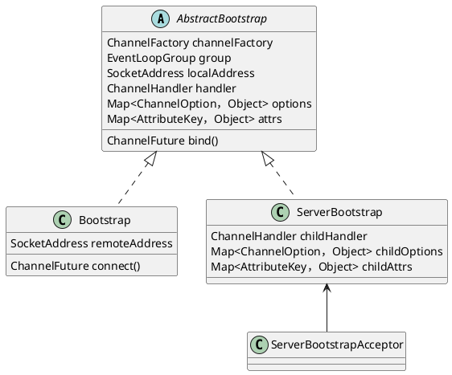


## EventLoop / EventExecutor (EventLoopGroup / EventExecutorGroup)
`EventLoop`即事件循环，以单线程来处理Netty中的各种I/O事件。一个`EventLoop`固定对应一个线程，管理一个或多个`Channel`。

`EventLoopGroup`是一组`EventLoop`，但`EventLoop`本身也是一个`EventLoopGroup`。

`EventLoop`继承了`EventExecutor`。类似的，`EventExecutorGroup`是一组`EventExecutor`，`EventExecutor`本身也是一个`EventExecutorGroup`。`EventLoopGroup`与`EventExecutorGroup`提供了`next`方法，从管理的一组对象中获得其中某个`EventLoop`或`EventExecutor`（一般采用轮转的选择方法）。

`EventExecutorGroup`继承了`ScheduledExecutorService`，即提供了安排线程执行定时、非定时、周期、非周期异步任务的功能。`EventLoopGroup`在其基础上提供了注册`Channel`的功能。

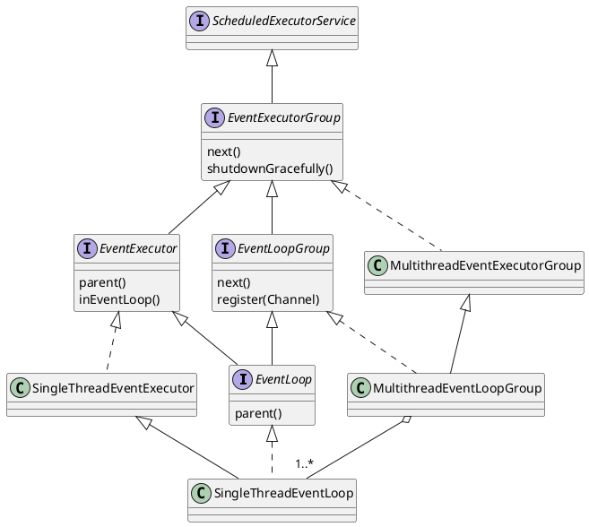


### MultithreadEventExecutorGroup
构造方法时可指定线程数量、线程工厂、`Executor`的选择策略工厂、`Executor`的附加参数等。

在构造时，会按照指定的线程数量调用多次`newChild`方法，创建相应数量的`EventExecutor`（此时还未创建同等数量的线程）。默认情况下，向被创建的`EventExecutor`传入`ThreadPerTaskExecutor`供其包装用。`ThreadPerTaskExecutor`每执行一个任务，使用线程工厂创建一个新的线程（`EventExecutor`只在初始化时利用`ThreadPerTaskExecutor`执行一个任务，即只创建一个线程）。

默认的Executor选择策略为轮转法；如果线程数量是2的N次幂，则用位操作替代加一取余。


### SingleThreadEventLoop与SingleThreadEventExecutor
`SingleThreadEventLoop`是实现`EventLoop`的主要抽象基类，其核心是`SingleThreadEventExecutor`。在`SingleThreadEventExecutor`的基础上，`SingleThreadEventLoop`提供了注册`Channel`的方法、维护了一个在每次事件循环迭代结束时执行的任务队列。多个`SingleThreadEventLoop`组成`MultithreadEventLoopGroup`，多个`SingleThreadEventExecutor`组成`MultithreadEventExecutorGroup`。

`SingleThreadEventExecutor`实际上是另一个`Executor`对象的代理，该对象在`SingleThreadEventExecutor`构造时由`MultithreadEventExecutorGroup`传入。默认传入的是`ThreadPerTaskExecutor`，每执行一个任务会创建一个新的线程，实际上`SingleThreadEventExecutor`只调用`ThreadPerTaskExecutor`一次，执行事件循环逻辑。`SingleThreadEventExecutor`对传入的`Executor`对象进行了包装，确保由其执行的`Runnable`可以通过`ThreadExecutorMap#currentExecutor`拿到该`SingleThreadEventExecutor`自身。

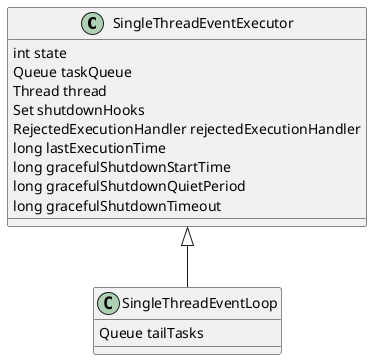

`SingleThreadEventExecutor`的状态：
* `ST_NOT_STARTED`：初始状态，未绑定任何线程
* `ST_STARTED`：事件循环已开始，已绑定某个某个线程
* `ST_SHUTTING_DOWN`：事件循环正在关闭中，在配置的时间段内仍可接受新任务
* `ST_SHUTDOWN`：事件循环已关闭，还需执行所有剩余任务、`shutdownHooks`、`cleanup`方法定义的清理逻辑
* `ST_TERMINATED`：事件循环已彻底关闭

`SingleThreadEventExecutor`的生命周期：
* 在`ST_NOT_STARTED`状态下，外部首次调用`execute`方法时，进行初始化，状态切换为`ST_STARTED`
    * 使用构造时`MultithreadEventExecutorGroup`传入的`executor`执行任务；默认的`ThreadPerTaskExecutor`在此时会创建一个新线程
    * 绑定新创建的线程与`SingleThreadEventExecutor`
    * 调用可由子类覆盖的抽象方法`run`（由子类实现事件循环逻辑）
* 在`ST_STARTED`状态下，如果在绑定的线程中执行的`run`方法正常返回（执行成功），或是抛出了异常（执行失败），状态切换为`ST_SHUTTING_DOWN`
* 在`ST_SHUTTING_DOWN`状态下：
    * 取消所有定时任务，但是仍保留在定时任务队列中
    * 初始化`gracefulShutdownStartTime`
    * 执行所有剩余的任务
        * 从定时任务队列中取出当前已超时的任务，放入正常任务队列中，直至定时任务队列中没有满足条件的任务，或是正常任务队列已满
        * 从正常任务队列中取出所有任务，逐一执行
        * 调用可覆盖的`afterRunningAllTasks`方法（例如：执行所有`tailTasks`）
        * 如果有未能放入正常任务队列的可执行定时任务，重复以上流程
    * 执行所有`shutdownHooks`
    * 如果当前时间距`gracefulShutdownStartTime`已超过了`gracefulShutdownTimeout`，状态切换到`ST_SHUTDOWN`
    * 如果当前时间距`lastExecutionTime`不超过`gracefulShutdownQuietPeriod`，每隔100`ms`重复以上流程检查是否有新任务提交，否则状态切换到`ST_SHUTDOWN`
* 在`ST_SHUTDOWN`状态，不再接受新任务
    * 最后一次的检查并执行队列中的剩余任务（包括已超时的定时任务）、`shutdownHooks`等
    * 调用可覆盖的`cleanup`方法执行清理逻辑（由子类实现）
    * 状态切换到`ST_TERMINATED`

调用`execute`方法执行任务的流程：
* 如果当前状态已转移到`ST_SHUTDOWN`之后，直接拒绝任务并抛出拒绝执行异常
* 向`taskQueue`中提交要执行的任务；如果`taskQueue`已满，调用`rejectedExecutionHandler`处理
* 如果调用者所在线程不是事件循环绑定的线程：
    * 检查是否需要对`SingleThreadEventExecutor`进行初始化
    * （因为`taskQueue#offer`可能阻塞线程）如果当前状态已转移到`ST_SHUTDOWN`之后，尝试从`taskQueue`中移除该任务；如果移除失败，说明任务已在事件循环中执行；如果移除成功，抛出拒绝执行异常

事件循环内部调用`takeTask`方法获取下一个要执行的任务的流程：
* `peek`定时任务队列中的首个任务
* 如果没有定时任务，从普通任务队列中获取一个任务（阻塞线程；特定的操作会向普通队列里加一个`WAKEUP_TASK`唤醒线程）
* 如果有定时任务：
    * 如果定时任务未超时，依然先从普通任务队列中获取一个任务，但是最多等待首个定时任务的超时时长
    * 如果定时任务已超时，或是等待指定时间后没有拿到普通任务，检查定时任务队列并将所有已超时的任务移入普通任务队列中，再从普通任务队列中取一个任务（防止普通任务队列中总有任务，而定时任务总是无法得到执行）

`SingleThreadEventExecutor`不赞成使用`ExecutorService`的`shutdown`、`shutdownNow`接口，需调用`shutdownGracefully`来关闭事件循环；可指定以下参数：
* `quietPeriod`：一个时间段，在关闭过程中这个时段内可以提交的任务；如果该时段内没有任何任务提交，事件循环将切换到`ST_SHUTDOWN`状态；如果时段内有任务提交，会重新开始计时
* `timeout`：如果距开始关闭的时间超过了指定的超时时长，事件循环将切换到`ST_SHUTDOWN`状态
流程如下：
* 检查参数有效性：```quietPeriod >= 0 && quietPeriod <= timeout```
* 如果当前状态已时`ST_SHUTTING_DOWN`之后，直接返回`terminationFuture`
* 循环直至CAS操作成功：将状态从当前值修改为`ST_SHUTTING_DOWN`；如果当前值已是`ST_SHUTTING_DOWN`之后，则保持状态不变
* 将传入的参数转化写入`gracefulShutdownQuietPeriod`、`gracefulShutdownTimeout`
* 如果事件循环尚未初始化（CAS操作时旧状态是`ST_NOT_STARTED`状态），则执行线程初始化流程，再执行关闭流程


### AbstractScheduledEventExecutor与ScheduledFutureTask
`AbstractScheduledEventExecutor`是`SingleThreadEventExecutor`的父类，提供执行定时任务的功能，使用一个`PriorityQueue`保存已提交的定时任务（这个队列只在事件循环中访问）。`ScheduledFutureTask`是`Netty`的定时任务类。

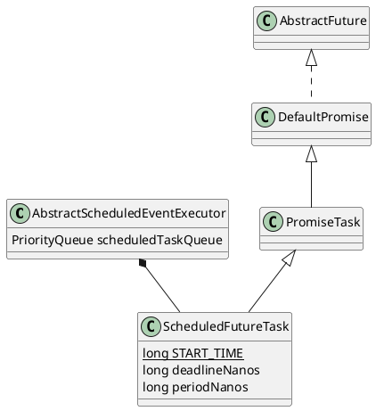

`ScheduledFutureTask`的成员变量`deadlineNanos`记录任务超时的相对纳秒时间；如果是固定频率或固定延迟的周期任务，`periodNanos`非0。

`ScheduledFutureTask#run`的流程：
* 确保在事件循环中执行
* 首先确认该定时任务是否已超时，因为任务在提交到事件循环，或是被取消时会提前执行
    * 如果任务已被取消（检查`isCancelled`），将其从定时任务队列中移除
    * 否则就是刚提交的状态，将其加入定时任务队列中
* 如果已超时：
    * 若任务未取消，则在事件循环中执行传入的`Runnable`
    * 如果是周期任务，更新`deadlineNanos`并将该任务重新加入队列

`ScheduledFutureTask#cancel`的流程：
* CAS操作修改任务状态
* 如果CAS操作成功：
    * 如果当前在事件循环中，直接操作定时任务队列
    * 否则调用关联的scheduledExecutor的`execute`方法（在事件循环中执行时再从定时队列中移除）

`AbstractScheduledEventExecutor#pollScheduledTask`，从定时任务队列中取出在指定的时间可以执行的任务：
* `peek`队列中的首个任务，检查其超时时间
* 如果与指定时间比已超时，将其从队列中移除

`AbstractScheduledEventExecutor#schedule`，安排定时任务：
* 用给定的`Runnable`构造一个`ScheduledFutureTask<Void>`，或是用给定的`Callable<V>`，构造一个`ScheduledFutureTask<V>`
* 如果当前在事件循环中，直接将任务插入定时队列，否则调用`execute`方法执行该任务（在事件循环中执行时再插入定时队列）


### DefaultEventLoop
`DefaultEventLoop`是最简单的`EventLoop`实现，它的`run`方法流程如下：
* 循环：
    * 取任务（`SingleThreadEventExecutor#takeTask`）
    * 执行任务并更新`lastExecutionTime`
    * 检查事件循环是否被关闭，并进行相关处理（`SingleThreadEventExecutor#confirmShutdown`）


### NioEventLoop
`NioEventLoop`在`SingleThreadEventLoop`的基础上，维护了一个`Selector`对象，支持注册`Channel`，以便在这个事件循环中实现多路互用。

`NioEventLoop`在构造时使用传入的`SelectorProvider`打开一个selector，存为成员变量`unwrappedSelector`，同时会尝试用`SelectedSelectionKeySetSelector`对其进行包装，存为成员变量`selector`，同时`unwrappedSelector`的`selectedKeys`通过反射替换成一个`SelectedSelectionKeySet`实例（基于数组的`Set<SelectionKey>`实现）。`SelectedSelectionKeySetSelector`对普通的`Selector`进行代理，在调用`select`、`selectoNow`方法前都会清空被代理的`Selector#selectedKeys`（因此`SelectedSelectionKeySet`无需计算哈希值）。

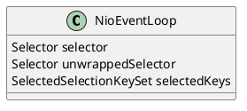

`NioEventLoop#run`的流程：
* 进行select操作：
    * 如果事件循环中有普通任务，调用无阻塞`selectorNow()`
    * 如果事件循环中没有普通任务，但有定时任务，根据最早触发的定时任务的超时时长调用`select(long)`
    * 如果事件循环中无任何任务，调用阻塞的`select()`
* 在select操作之后，按照设置的`ioRatio`分配时间调用`processSelectedKeys`和`runAllTasks`；如果没有select到任何key，以最短的时间执行队列中的其他任务（调用`processSelectedKeys`前后记录用时；`runAllTasks`方法支持参数控制执行最大时长）
* 检查事件循环是否被关闭，如果是，在执行通用关闭流程前，关闭所有关联的`Channel`、取消所有的`SelectionKey`等

在select的过程中，局部变量`selectCnt`用于检测是否发生了空轮询的情况（`selector.select()`时提前返回多次），如果是，通过重建selector、重新关联所有Channel来进行修正。

`NioEventLoop#processSelectedKeys`的流程：
* 遍历`selectedKeys`（普通selector的是个`HashSet`，优化版的是`SelectedSelectionKeySet`），根据`key.attachment()`的类型分别处理：
    * 如果是`NioTask`：调用`NioTask#channelReady`；如果发生错误则调用取消该key，调用`NioTask#channelUnregistered`；最后再检查一遍key是否有效，如果无效也立即调用`NioTask#channelUnregistered`
    * 如果是`AbstractNioChannel`，根据`key.readyOps()`，调用`AbstractNioChannel.NioUnsafe`对象的相关方法，处理完成连接、读、写等操作

由于`NioEveltLoop`会在调用`Selector#select()`、`Selector#select(long)`时阻塞线程，因此`NioEventLoop#wakeup`调用了`Selector#wakeup`以中断select操作、唤醒线程。


## Channel / AbstractChannel / Unsafe / AbstractUnsafe
Netty提供了`Channel`，对socket连接进行封装，有以下特征：
* 提供了各种I/O操作的方法，且这些方法都是异步的
* 可以关联到某个事件循环，并在这个事件循环中处理I/O事件
* 所有I/O事件交由关联的`ChannelPipeline`按照特定的顺序进行处理
* 所有非安全操作交由关联的`Unsafe`对象代理执行
* 提供一个`CloseFuture`，在关闭时执行注册的回调

`AbstractChannel`是该接口的基础实现，所有的非`do`开头的I/O操作方法都是交给`ChannelPipeline`分配给其中的`ChannelHandler`负责处理；所有`do`开头的抽象I/O方法，供内置的`Unsafe`对象调用，由子类实现负责进行实际的I/O操作。`Unsafe`对象的各种“公开”方法并不对用户公开，仅供Netty内部使用（如事件循环处理`selectedKeys`）。

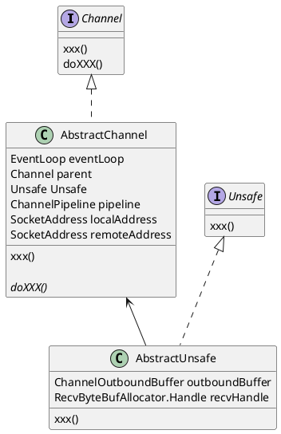

`AbstractUnsafe`是`AbstractChannel`的内部类，负责执行各种“不安全”的I/O操作。

调用`register`方法关联某个事件循环：
* 如果已注册过，或是`Channel`与`EventLoop`不兼容（如`AbstractNioChannel`只能关联到`NioEventLoop`），抛`IllegalStateException`
* 修改`AbstractChannel#eventLoop`；如果当前线程即传入的事件循环，直接执行后续的注册流程，否则向事件循环中提交一个任务执行后续的注册流程
* 修改`AbstractChannel`的注册状态相关的成员变量，调用由子类实现的`doRegister`方法，并调用`ChannelPipeline`的相关方法处理相关的事件：
    * 如果是首次注册，在把返回的promise标记为成功之前，`pipeline.callHandlerAddedForAllHandlers()`
    * 把返回的promise标记为成功，可能会执行listener的回调
    * 流水线处理`channelRegistered`事件
    * 如果`Channel`已连接，在首次注册时让流水线处理`channelActive`事件

调用`bind`方法绑定某个地址：
* 调用由子类实现的`AbstractChannel#doBind`
* 如果操作之后`isActive`（例如`ServerSocket`），流水线处理`channelActive`事件

`AbstractUnsafe`没有给出`connect`方法的基础实现，因为只有特定类型的`Channel`才支持该方法；调用`disconnect`断开连接的流程如下：
* 调用由子类实现的`AbstractChannel#doDisconnect`
* 如果操作之前`isActive`，流水线处理`channelInactive`事件

调用`close`方法关闭`Channel`：
* 检查相关标记防止多次调用关闭方法（在关闭流程执行中再次调用，会合并两次返回的promise的listener）
* `outboundBuffer`置null，防止新数据写入
* 调用由子类实现的`AbstractChannel#prepareToClose`方法；可能返回一个用于执行后续流程的`Executor`，如果没有则继续在当前线程中执行后续流程
* 调用由子类实现的`AbstractChannel#doClose`方法
* 如果原`outboundBuffer`非空，处理`failFlushed`，并将其关闭
* 调用由子类实现的`AbstractChannel#doDeregister`，解除`Channel`与`EventLoop`、`Selector`的关联，根据相关状态由流水线处理`channelInactive`、`channelUnregistered`事件

调用`beginRead`方法安排`Channel`读取数据，实际是代理给子类实现的`AbstractChannel#doBeginRead`方法。

调用`write`方法写入数据：
* 确认当前状态可写数据，即```outboundBuffer != null```
* 调用子类可覆盖的`filterOutboundMsg`对写入的数据进行前置处理
* 向`outboundBuffer`中加入处理后的数据

调用`flush`方法向远程刷入发送缓存中的数据：
* 确认当前状态可写数据，即```outboundBuffer != null```
* 检查相关标记防止多次调用该方法
* 调用由子类实现的`AbstractChannel#doWrite`方法，发送`outboundBuffer`中的数据
* 清除正在flush的标记


### AbstractNioChannel
基于`Selector`的`Channel`抽象类，包含部分`do*`方法的基础实现。

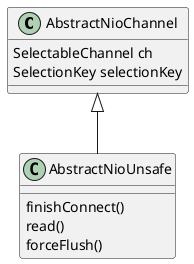

`doRegister`方法将包装的`SelectableChannel`与指定的`NioEventLoop#unwrappedSelector`进行注册，初始状态下`interestOps`为0；`AbstractNioChannel`会保存得到的`SelectionKey`的引用。

`doDeregister`方法实际调用了`NioEventLoop#cancel`：取消`SelectionKey`，并更新`NioEventLoop`的有关计数。

`doBeginRead`方法将`SelectionKey#interestOps`与构造时传入的`readInterestOps`进行或操作并更新（`readInterestOps`由子类决定，可能是`OP_READ`或`OP_ACCEPT`）


### NioUnsafe / AbstractNioUnsafe
`NioUnsafe`在`Unsafe`基础上增加了`read`、`finishConnect`、`forceFlush`等方法。

调用`connect`方法连接到指定的远程地址：
* 检查相关标记防止多次调用连接方法
* 调用由子类实现的`AbstractNioChannel#doConnect`方法，如果返回`true`，更新`connectPromise`的状态，根据之前的状态让流水线处理`channelActive`事件
* 否则按照配置的连接超时时间，添加定时任务，在超时时将`connectPromise`标记为失败，同时调用`close`关闭`Channel`

调用`finishConnect`方法完成连接：调用由子类实现的`AbstractNioChannel#doFinishConnect`方法，更新`connectPromise`的状态，根据之前的状态让流水线处理`channelActive`事件。


### AbstractNioMessageChannel / NioMessageUnsafe
`AbstractNioMessageChannel`是基于某种消息对象的`AbstractNioChannel`基础抽象类，提供了两个抽象方法供子类实现负责消息消息的读写：
* `doReadMessages`
* `doWriteMessage`

`AbstractNioMessageChannel`实现了`AbstractChannel#doWrite`：
* 从发送缓存中取出一个消息对象（`ChannelOutboundBuffer#current`），如果无，则修改`SelectionKey#interestOps`，取消`OP_WRITE`标记
* 调用由子类实现的`doWriteMessage`完成对象的序列化与具体的刷入过程，最多重试配置的自旋次数直至写入成功（`ChannelConfig#writeSpinCount`）
* 如果写入成功，将消息对象从发送缓存中移除
* 如果写入失败，确保`SelectionKey#interestOps`中包含`OP_WRITE`，以等待下次写入机会
* 循环重复以上过程，直至发送缓存中午内容或是发生写入失败的情况

`NioMessageUnsafe`实现了`NioUnsafe#read`：
* 调用由`AbstractNioMessageChannel`子类实现的`doReadMessages`方法，将消息对象读入`NioMessageUnsafe#readBuf`中
* 重复以上流程，直至无消息可读，或是Channel已关闭，或是接收缓存管理决定跳出读取循环，或是捕获到异常
* 遍历`readBuf`中读取到的消息对象，对流水线触发`channelRead`事件
* 清空`readBuf`，对流水线触发`channelReadComplete`事件


### NioServerSocketChannel
`NioServerSocketChannel`是`AbstractNioMessageChannel`的一个子类，它的`readInterestOps`即`OP_ACCEPT`；当有消息“可读”时，它的`doReadMessages`方法从关联的`ServerSocketChannel`处接受得到一个`SocketChannel`，并包装为`NioSocketChannel`作为“读取”到的消息对象。

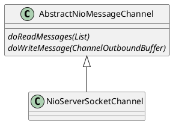


### AbstractNioByteChannel / NioByteUnsafe
`AbstractNioByteChannel`是基于字节流的`AbstractNioChannel`基础抽象类，提供了一下抽象方法供子类实现负责消息的读写：
* `doReadBytes`
* `doWriteBytes`
* `doWriteFileRegion`

`AbstractNioByteChannel`实现了`AbstractChannel#doWrite`：
* 从发送缓存中取出一个对象（`ChannelOutboundBuffer#current`），如果无，则修改`SelectionKey#interestOps`，取消`OP_WRITE`标记
* 根据所取对象的类型，调用子类实现的`doWriteBytes`（`ByteBuf`）或`doWriteFileRegion`（`FileRegion`）方法；当`ByteBuf`或`FileRegion`全部写完时，将其从发送缓存中移除
* 循环重复以上步骤，直至发送缓存为空提前返回，或是尝试的写操作次数达到了配置的自旋次数（`ChannelConfig#writeSpinCount`）

`NioByteUnsafe`实现了`NioUnsafe#read`：
* 根据`ChannelConfig`分配一个`ByteBuf`准备缓存接收到的数据
* 调用由子类实现的`doReadBytes`方法将数据读入上一步分配的`ByteBuf`中
* 如果读到的数据长度非0（Channel也没被关闭），对流水线触发`channelRead`事件
* 重复以上步骤，直至无数据可读，或是Channel已关闭，或是接收缓存管理决定跳出循环，或是捕获到异常
* 跳出循环后，对流水线触发`channelReadComplete`事件
* 如果发现Channel已关闭，调用`AbstractUnsafe#close`立即做关闭处理；如果Channel被设置为允许半关闭，则调用`AbstractNioByteChannel#shutdownInput`关闭接收数据方向
* 如果捕获到异常，进行如下处理：
    * 如果捕获异常前`ByteBuf`已读取到数据，则触发`channelRead`
    * 触发`channelReadComplete`与`exceptionCaught`事件
    * 如果捕获异常前已发现Channel被关闭，或是发生了`IOException`，进行关闭处理


### NioSocketChannel
`NioSocketChannel`是`AbstractNioByteChannel`的一个子类。除了`shutdown`外，`NioSocketChannel`提供`shutdownInput`或`shutdownOutput`关闭某个方向的通信。

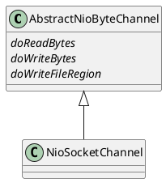

`doConnect`方法的实现：
* 先绑定本地地址（`SocketChannel#bind`或`Socket#bind`）
* 调用`SocketChannel#connect`或`Socket#connect`
* 如果没有立即返回成功，在`SelectionKey#interestOps`中设置`OP_CONNECT`（后续再调用`SocketChannel#finishConnect`方法）
* 如果发生异常，关闭Channel

`doReadBytes`方法的实现：`ByteBuf#writeBytes`。

`doWriteBytes`方法的实现：`ByteBuf#readBytes`。

`doWriteFileRegion`方法的实现：`FileRegion#transferTo`。

`doWrite`方法的实现：
* 如果发送缓存中无数据，清除`SelectionKey#interestOps`中的`OP_WRITE`并直接返回
* 如果发送缓存中待写入的数据全是`ByteBuf`类型，将其转换成direct内存区的`java.nio.ByteBuffer`（以避免多一次数据拷贝）
    * 统计待写数据长度
    * 调用`SocketChannel#write`，得到实际写入的数据长度（如果写入数据长度非整数，提前返回并确保`SelectionKey#interestOps`中有`OP_WRITE`
    * 根据实际写入的数据长度清理发送缓存，并调整单次写入所允许的最大字节数（根据注释，某些OS的发送缓存大小可变）
    * 记录一次写操作
* 否则调用`AbstractiNioByteChannel#doWrite0`方法，并统计写操作的次数
* 循环执行以上流程，直至发送缓存中无数据，或是写操作次数超过配置的自旋次数（`ChannelConfig#writeSpinCount`）


### ChannelOutboundBuffer
`ChannelOutboundBuffer`是`AbstractChannel`用于缓存待发送数据的内部结构。每个待发送的数据被封装在`Entry`对象中，多个`Entry`可形成一个链表结构，同时`ChannelOutboundBuffer`维护了三种特殊节点的引用：
* `flushedEntry`：指向链表的首个待刷到远程的节点
* `unflushedEntry`：指向链表的首个未刷到远程的节点
* `tailEntry`：指向链表末端节点

`Entry`列表结构大致为：
```Entry(flushedEntry) --> ... Entry(unflushedEntry) --> ... Entry(tailEntry)```。

所有`Entry`对象受一个对象池管理，通过`newInstance`方法从对象池中取出一个可用对象以构造新的`Entry`对象，通过`recycle`方法回收被移除的`Entry`对象。

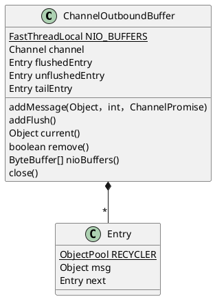

调用`addMessage`缓存待发送的消息对象：
* 将传入的消息对象包装成`Entry`
* 将得到的`Entry`插入链表末端，按需更新三个`Entry`引用
* 更新链表中待处理的消息总大小（包括额外开销），如果超过配置的值（`ChannelConfig#writeBufferHighWaterMark`），在流水线中触发`channelWritabilityChanged`事件（通知缓存不可继续写入）

调用`addFlush`将所有已添加的消息对象标记未待刷状态：
* 按需更新`flushedEntry`位置
* 从`unflushedEntry`开始遍历后续节点，更新待刷入消息数量`flushed`
* `unflushedEntry`置空

调用`current`返回当前可刷入的消息对象：`flushedEntry#msg`。

调用`remove`移除`flushedEntry`：
* 取出`flushedEntry`；如果为空，提前返回，并清理`NIO_BUFFERS`
* 更新待刷入的消息数量`flushed`
* 后移`flushedEntry`；如果已是尾节点，则置空
* 更新链表中待处理的消息总大小（包括额外开销），如果低于配置的值（`ChannelConfig#writeBufferLowWaterMark`），在流水线中触发`channelWritabilityChanged`事件（通知缓存可继续写入）
* 调用`Entry#recycle`回收该节点

在操作关联的`ByteBuffer`之后（不影响`ByteBuf`的读写位置），调用`removeBytes`移除已刷入的字节：
* 比较要移除的字节数与ByteBuf中可用的字节数，决定：
    * 移除整个`Entry`
    * 调整`ByteBuf#readerIndex`
* 重复以上步骤（可能涉及多个`Entry`）
* 清空`NIO_BUFFERS`

调用`nioBuffers`返回与当前缓存的消息对象相对应的`ByteBuffer`数组（所有消息对象必须是`ByteBuf`）：
* 取出`NIO_BUFFERS`（一个`FastThreadLocal<ByteBuffer[]>`）
* 从`flushedEntry`开始，到`unflushedEntry`为止，遍历所有可刷入的`Entry`：
    * 确保可用字节数大于0
    * 计算组成该`ByteBuf`的`ByteBuffer`数量，检查是否需要扩展`NIO_BUFFERS`的长度
    * 根据对应的`ByteBuffer`数量，将`ByteBuf#buf`或`ByteBuf#bufs`加入`NIO_BUFFERS`（`buf`或`bufs`可能为空，此时需要先生成对应的`ByteBuffer`）


### RecvByteBufAllocator
负责分配用于数据接收的缓存，设计目标时分配的大小能刚好存下所有待接收的数据。主要方法在其内部接口`Handler`中。

```plantuml
@startuml
interface RecvByteBufAllocator
interface RecvByteBufAllocator.Handle {
    ByteBuf allocate(ByteBufAllocator)
    reset(ChannelConfig)
    incMessagesRead(int)
    attemptedBytesRead(int)
    lastBytesRead(int)
    boolean continueReading()
    readComplete()
}

interface MaxBytesRecvByteBufAllocator {
    maxBytesPerRead(int)
    maxBytesPerIndividualRead(int)
}
interface MaxMessagesRecvByteBufAllocator {
    maxMessagesPerRead(int)
}


RecvByteBufAllocator <-- RecvByteBufAllocator.Handle
RecvByteBufAllocator <|-- MaxBytesRecvByteBufAllocator
RecvByteBufAllocator <|-- MaxMessagesRecvByteBufAllocator

MaxBytesRecvByteBufAllocator <|.. DefaultMaxBytesRecvByteBufAllocator

MaxMessagesRecvByteBufAllocator <|.. DefaultMaxMessagesRecvByteBufAllocator
DefaultMaxMessagesRecvByteBufAllocator <|-- FixedRecvByteBufAllocator
DefaultMaxMessagesRecvByteBufAllocator <|-- AdaptiveRecvByteBufAllocator
@enduml
```

`RecvByteBufAllocator.Handler`通过以下方法收集某次读取操作相关的数量信息：
* `reset`：因为实例复用的原因，在一次读取操作开始前重置相关计数
* `incMessagesRead`：增加已读消息数量
* `attemptedBytesRead`：记录准备读取的字节数
* `lastBytesRead`：记录实际读取的字节数

`RecvByteBufAllocator.Handler`提供`allocate`方法分配一个大小“恰好”的数据接收缓存。

`RecvByteBufAllocator.Handler`提供`continueReading`方控制读取操作的循环流程是否应该继续执行。

一般的使用流程为：
* 调用`NioUnsafe#read`开始一次读取操作
* 在准备阶段调用`reset`
* 开始读取循环
    * 调用`allocate`分配一个`ByteBuf`
    * 根据`ByteBuf#writableBytes`，调用`attemptedBytesRead`记录准备读取的字节数
    * 将待接收数据读入`ByteBuf`中，根据实际读取的字节数调用`lastBytesRead`进行记录
    * 如果读取到的字节数大于0，调用`incMessagesRead`记录读到的消息数
    * 调用`continueReading`判断是否继续循环
* 跳出循环后，调用`readComplete`做善后处理

`RecvByteBufAllocator`有两个子接口：
* `MaxBytesRecvByteBufAllocator`：按字节数控制每次接收数据的大小
* `MaxMessagesRecvByteBufAllocator`：按消息对象数控制每次接收数据的大小

`DefaultMaxBytesRecvByteBufAllocator`是`MaxBytesRecvByteBufAllocator`的默认实现，每次分配的`ByteBuf`大小取`min(单次循环最多读取的字节数，单次读取操作剩余待读取字节数)`。判断是否继续循环过程的依据是： 单次读取操作中已读字节数小于给定的上限值，且上一次试图读取的字节数等于实际读取的字节数（即还有待读取的已接收数据）

`DefaultMaxMessagesRecvByteBufAllocator`是`MaxMessagesRecvByteBufAllocator`的默认抽象实现。有两个子类：
* `FixedRecvByteBufAllocator`：按固定的大小分配`ByteBuf`
* `AdaptiveRecvByteBufAllocator`
    * 初始化时，将给定的缓存大小范围划分为多个档次，构成一个缓存大小数组，选定一个值为初始分配的缓存大小
    * 提供一个`record`方法记录实际读取到的字节数，根据大小关系动态调整下次分配的缓存大小
    * 如果一次循环中读取到的数据能填满缓存，调用`lastBytesRead`时，需要调整下次分配的缓存大小
    * 调用`readComplete`时，记录本次读取操作获得的总字节数，并据此调整下次分配的缓存大小


## ChannelPipeline


## ChannelHandler


## ByteBuf
Netty提供了`ByteBuf`类作为`java.nio.ByteBuffer`的替代。相较于`ByteBuffer`需要进行`flip`操作，`ByteBuf`提供了两个控制读、写操作的下标变量：`readerIndex`、`writerIndex`。两者满足关系：```0 <= readerIndex <= writerIndex <= capacity```。

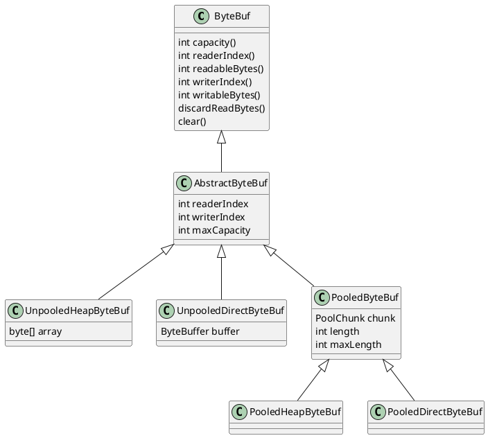


### PoolChunk
`PoolChunk`是使用`PageRun/PoolSubpage`算法来管理内存的工具类，被`PooledByteBuf`使用。

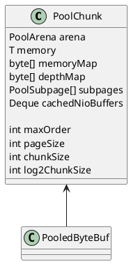

基本的概念：
* `page`：最小可分配的内存单元
* `chunk`：`page`的集合，一个`chunk`中有`2^n`个`page`，`chunkSize == 2^n * pageSize`

由于被管理的`page`数量是2的N次幂，因此可以使用一个完全二叉树来进行管理：
* 分配对应`chunkSize`的整块内存空间
* 初始化一个对应`2^n`个叶子节点的完全二叉树的字节数组`memoryMap`管理内存的分配
* `memoryMap[i]`记录下标`i`对应子树中首个可分配节点的绝对层次
    * 层次的划分：
        * 层次0 / 共1个节点 / 每个节点对应`chunkSize`的空间
        * 层次1 / 共2个节点 / 每个节点对应`chunkSize/2`的空间
        * ...
        * 层次`2^n` / 共`2^n`个节点 / 每个节点对应`chunkSize/(2^n)`的空间（即`pageSize`）
    * 记录的层次含义：
        * `memoryMap[i] == 节点i对应的层次`，即该节点对应的整块内存都未分配
        * `memoryMap[i] > 节点i对应的层次`，即该节点下的某个子节点已被分配；如果`memoryMap[i] == n + 1`，即该节点对应的整块内存均已被分配
* 分配内存的过程：
    * 如果要分配`size`大小的内存，首先将`size`正规化，计算得到能满足需求的最小的`page`个数（该个数为2的N次幂），因此得到对应二叉树节点的层次
    * 查询`memoryMap`，从根节点开始遍历`memoryMap`
        * 如果`memoryMap[1] > depth`，则不能分配内存
        * 如果`左子节点的值 <= depth`，递归遍历左子树寻找可用的节点
        * 否则递归遍历右子树寻找可用的节点

`PoolChunk`的初始化：
* 由外部分配整块内存`memory`，传入`pageSize`，分块数量（2的N次幂`maxOrder`，总分块数`maxSubpageAllocs = 2^maxOrder`)
* 初始化`memoryMap`和`depthMap`，填充二叉树中各节点的初始层次取值
